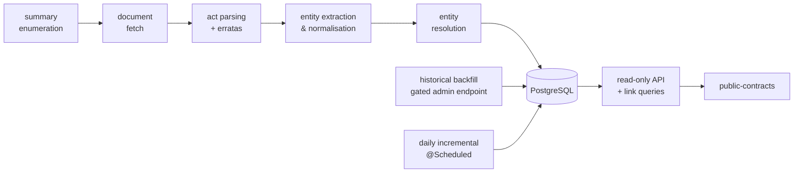

# Mercator — Architecture Decision Records

This folder records the significant architectural decisions for Mercator, one per file, in
[MADR](https://adr.github.io/madr/)-style format: **Status, Context, Decision,
Consequences, Alternatives considered**.

**Lifecycle:** an ADR is _Proposed (pending approval)_ and may be **freely updated while
Proposed**; only the maintainer marks one **Accepted**, and **Accepted ADRs are immutable**
(change them only via a new superseding ADR).

> **Note (2026-06).** ADR-0005/0006/0013/0014 were **amended in place** to record the
> single-module redesign (collapsing `shared`/`server`/`ingester` into one Micronaut module and
> moving the historical import to a gated in-server endpoint), with the change noted in each of
> their `## Status` lines. Incidental references to the removed `ingester`/`shared` module were
> also updated for consistency in ADR-0007/0015/0016/0018/0020. This is a maintainer-approved
> relaxation of the post-code immutability rule for a coordinated redesign. See `docs/CLAUDE.md`
> → _ADR lifecycle & approval_.
>
> **Note (2026-06).** ADR-0014 was further **amended in place** to permit the vendor-neutral
> `jakarta.inject` (JSR-330) DI annotations in the domain core (dropping `@Factory` boilerplate),
> and subsequently to allow infrastructure-facing **Micronaut tooling in the driven adapters**
> (`io.micronaut.*` is forbidden only in the domain core). The layer boundaries are now enforced by
> an ArchUnit test (`LayeredArchitectureTest`). Maintainer-approved in-place amendments, noted in
> ADR-0014's `## Status` line.
>
> **Note (2026-06).** A further **simplification** amended ADR-0014/0005 in place: the domain core
> is no longer required to be framework-free — domain data objects may carry `@MappedEntity` /
> `@Serdeable` and serve directly as DB entities / API bodies (a parallel persistence row or DTO is
> added only where the shape differs), and ArchUnit now enforces **only the inward-only dependency
> direction**. Blocking request handling runs on **Java virtual threads**
> (`@ExecuteOn(TaskExecutors.BLOCKING)` on Java 25). Maintainer-approved in-place amendments, noted
> in the respective `## Status` lines.

## Architecture overview

The sections below synthesise the **current** state of the architecture from the Accepted ADRs.
They are a snapshot for orientation — each ADR (recorded per the process in
[0001](0001-record-architecture-decisions.md)) remains the source of truth, and where this
overview and an ADR disagree, the ADR wins. This reflects the post-2026-06 design (single module,
domain-as-entity, virtual threads); the amendment notes above record how it got here.

### What Mercator is & the mandate

Mercator turns Spain's **BORME** (_Boletín Oficial del Registro Mercantil_) into a queryable
database and graph of companies, the people associated with them (administrators, attorneys…), and
the links between them (shared administrators, shared addresses, multi-hop relationships). Its
primary consumer is a sibling **public-contracts** project that detects related bidders/awardees.
The overriding mandate is **cheap and simple** — a single EU VPS, free public data, no commercial
BORME API ([0011](0011-cheap-eu-vps-hosting.md)) — and almost every decision below is downstream of
it.

### System shape

A single **Java 25 + Micronaut** module, built by a single-project **Gradle 9.5** build (pinned via
the wrapper). One artifact hosts every workload: the read-only HTTP API, the daily-incremental
`@Scheduled` job, and the gated historical-import admin endpoint
([0005](0005-java-ingester-and-read-api.md)). Internally it follows **hexagonal architecture**,
applied pragmatically at the layer boundary by package — `domain` (core), `infrastructure` (driven
adapters), `application` (driving adapters + wiring) — with an **inward-only** dependency direction
enforced by an ArchUnit `LayeredArchitectureTest`. The domain core is not framework-free: domain
data objects may carry `@MappedEntity` / `@Serdeable` and serve directly as DB entities / API
bodies, with a parallel row or DTO added only where the shape genuinely differs. Blocking request
handling runs on **Java virtual threads** via `@ExecuteOn(TaskExecutors.BLOCKING)`, avoiding
reactive complexity ([0014](0014-hexagonal-architecture.md)).

### V1 pipeline

### Data sources & ingestion

Summaries come from the documented **`datosabiertos` REST API**
(`/datosabiertos/api/borme/sumario/{AAAAMMDD}`), not the undocumented legacy `xml.php`
([0003](0003-datosabiertos-rest-api-over-legacy-xml.md)). Each Sección A document is ingested from
its **per-document XML** (clean `<metadatos>` + pre-segmented body), with a fail-soft per-document
fallback chain of **XML → `txt.php` → PDF** ([0002](0002-structured-xml-over-pdf-parsing.md)). All
BOE access is governed by a shared politeness/resilience policy: one global token-bucket limiter
(~1–2 req/s), a descriptive `User-Agent`, exponential backoff + jitter with `Retry-After` on
`429`/`5xx`, `404` treated as a skip, `robots.txt` honoured, and **fail-soft** behaviour where a
failed fetch becomes a logged, re-runnable `borme_log` gap rather than a crash
([0018](0018-boe-source-politeness-and-retry.md)).

### Write paths & ingestion

There are **two write paths, both writing directly to PostgreSQL** through one in-server ingestion
service — neither writes over a public HTTP surface
([0006](0006-hybrid-write-path.md)): **historical backfill** (triggered via the gated admin
endpoint, bulk-`COPY` into staging + a single SQL merge) and **daily incremental** (the `@Scheduled`
job, row-by-row upsert of the small daily volume). Idempotency is enforced at two layers
(app-level `borme_log` short-circuit + DB-level `UNIQUE … ON CONFLICT`), so runs are safely
resumable. _Fe de erratas_ corrections are **auto-applied** to the data they fix while preserving
an audit trail (the errata act is always stored, pre-correction value kept), failing safe by
storing an errata unapplied-but-flagged when its target or correction can't be confidently resolved
([0015](0015-auto-apply-fe-de-erratas-corrections.md)).

### Parsing & domain knowledge

The parser reuses **bormeparser**'s regex and act/role/province dictionaries (the best prior art
among surveyed BORME tooling) rather than rebuilding that domain knowledge, driven off the XML prose
body. Because bormeparser is GPLv3 and Mercator is already GPLv3, the ported parser stays
GPL-compatible ([0012](0012-reuse-bormeparser-dictionaries-gpl.md)).

### Data model & entity resolution

Entity resolution lives in exactly one place: shared **PL/pgSQL** functions
(`resolve_company` / `resolve_person`) invoked identically by both write paths; the parser emits
normalised-but-unresolved records and **never resolves identity**
([0007](0007-single-source-of-truth-entity-resolution.md)). A company's natural key is its registry
coordinates — **Hoja + province** (`UNIQUE (reg_hoja, province_code)`) — because the NIF is not
published and names change; name-based fuzzy matching is reserved for _search_ and _cross-source_
joins ([0008](0008-registry-coordinates-as-company-natural-key.md)). People have no identifier at
all, so person identity is **probabilistic**: a normalised-name key plus co-occurrence
corroboration yields **confidence scores**, and person-derived links are always surfaced as scored
candidates, never as established facts ([0009](0009-probabilistic-person-resolution.md)).

### Storage, links & migrations

**PostgreSQL 18** is the single datastore (`pg_trgm`, `fuzzystrmatch`, `unaccent`), doing both
fuzzy matching and graph-ish traversal — no second datastore
([0004](0004-postgresql-as-primary-datastore.md)). Link detection is pure SQL: indexed self-joins
for direct links and `WITH RECURSIVE` for bounded multi-hop traversal with cycle detection; the
in-database Apache AGE extension is deferred until a query genuinely needs it
([0010](0010-postgresql-ctes-over-graph-db.md)). The schema — tables, indexes, constraints, and the
PL/pgSQL resolution functions — is owned by **Flyway**, shipped as a single `V1.0.0__baseline.sql`
baseline with forward-only, semver-versioned migrations applied automatically on startup so schema
and Java callers advance atomically ([0016](0016-database-schema-migrations.md)).

### API & auth

The public API is **read-only**. In production every request needs a valid `X-API-Key` (keys read
from the environment, **fail-closed** by default, anonymous only in explicit local/dev). The
historical-import admin endpoint is stricter: it always requires the key in every environment **and**
an independent enable toggle (`mercator.imports.historical.enabled`, default off), so an import needs
both an explicit flag and a valid key ([0013](0013-api-key-auth-and-config.md)).

### Deployment & operations

Deployment is a single cheap **EU VPS** (Hetzner CX32 baseline) running PostgreSQL + the Java API in
Docker behind a reverse proxy terminating TLS ([0011](0011-cheap-eu-vps-hosting.md)). Because the
system runs unattended, observability targets the core risk — a silently-failing daily job:
structured JSON logs to stdout, Micrometer metrics + an unauthenticated `/health`, a persisted
last-success heartbeat, and a **dead-man's-switch** external cron monitor that alerts if the
expected ping doesn't arrive ([0017](0017-observability-logging-and-alerting.md)). Durability is a
nightly `pg_dump --format=custom`, **encrypted before leaving the host** and shipped to EU-region
cold object storage, with a tested restore runbook and bounded retention (RPO ≈ 24 h)
([0019](0019-backup-restore-and-retention.md)). Secrets live only as runtime environment variables
from a root-owned, gitignored `.env` — never in the image, repo, or `application.yml` — with
least-privilege DB roles (separate runtime vs schema-owner/migration roles)
([0020](0020-secrets-management.md)).

### Legal & data reuse

Three distinct regimes apply at once. BORME content is reused as **public-sector information** under
Law 37/2007, which makes **attribution** (source + retrieval date) and a _"not authentic — only the
signed BOE PDF is official"_ disclaimer **product requirements** of the API and docs
([0021](0021-borme-data-reuse-and-attribution.md)). Independently, the ported parser code carries
the **GPLv3** obligation ([0012](0012-reuse-bormeparser-dictionaries-gpl.md)), and the personal data
of named people is governed by **GDPR/LOPDGDD** (handled in the data-protection spec).

## Index

| ADR | Title | Status |
|-----|-------|--------|
| [0001](0001-record-architecture-decisions.md) | Record architecture decisions | Accepted |
| [0002](0002-structured-xml-over-pdf-parsing.md) | Prefer structured text/XML over PDF parsing for Sección A | Accepted |
| [0003](0003-datosabiertos-rest-api-over-legacy-xml.md) | Use the `datosabiertos` REST summary API over legacy `xml.php` | Accepted |
| [0004](0004-postgresql-as-primary-datastore.md) | PostgreSQL as the single primary datastore | Accepted |
| [0005](0005-java-ingester-and-read-api.md) | Single Micronaut module: read API, daily scheduler, and historical-import endpoint | Accepted |
| [0006](0006-hybrid-write-path.md) | Two write paths, both in-server and direct to the DB | Accepted |
| [0007](0007-single-source-of-truth-entity-resolution.md) | Single source of truth for entity resolution | Accepted |
| [0008](0008-registry-coordinates-as-company-natural-key.md) | Registry coordinates (Hoja+province) as the company natural key | Accepted |
| [0009](0009-probabilistic-person-resolution.md) | Probabilistic person resolution with confidence scores | Accepted |
| [0010](0010-postgresql-ctes-over-graph-db.md) | PostgreSQL recursive CTEs over a graph database | Accepted |
| [0011](0011-cheap-eu-vps-hosting.md) | Single cheap EU VPS for hosting | Accepted |
| [0012](0012-reuse-bormeparser-dictionaries-gpl.md) | Reuse bormeparser dictionaries (GPL) | Accepted |
| [0013](0013-api-key-auth-and-config.md) | API key authentication, configured per environment | Accepted |
| [0014](0014-hexagonal-architecture.md) | Hexagonal architecture (ports and adapters) | Accepted |
| [0015](0015-auto-apply-fe-de-erratas-corrections.md) | Auto-apply Fe de erratas corrections, with an audit trail | Accepted |
| [0016](0016-database-schema-migrations.md) | Versioned database schema migrations with Flyway | Accepted |
| [0017](0017-observability-logging-and-alerting.md) | Observability: logging, metrics, heartbeat and alerting | Accepted |
| [0018](0018-boe-source-politeness-and-retry.md) | BOE source politeness and fail-soft retry policy | Accepted |
| [0019](0019-backup-restore-and-retention.md) | Tested backup/restore and retention policy | Accepted |
| [0020](0020-secrets-management.md) | Secrets management on a single VPS | Accepted |
| [0021](0021-borme-data-reuse-and-attribution.md) | BORME data reuse and attribution | Accepted |
