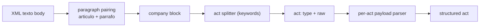

# Feature — Act parsing

## Summary

Turn a document's XML body into structured acts: use the `
`/
`
` segmentation to form company blocks, identify each act by keyword, and
extract act-specific payloads — reusing bormeparser's domain dictionaries.

## Related specs / ADRs

- Specs: [3 — Extraction](../specs/03-extraction.md)
- ADRs: [0002 — Prefer structured text/XML over PDF](../architecture/0002-structured-xml-over-pdf-parsing.md), [0012 — Reuse bormeparser dictionaries](../architecture/0012-reuse-bormeparser-dictionaries-gpl.md), [0015 — Auto-apply Fe de erratas](../architecture/0015-auto-apply-fe-de-erratas-corrections.md)

## Functional behaviour

- **Block splitting:** the XML pre-segments the document — each `
` is a
  company header line (often `NNNNN - COMPANY NAME SL.`) and the following
  `
` carries that company's act(s), ending with the `Datos registrales.`
  footer. (Fallback text/PDF input has no markup, so block splitting then keys off the
  company-header line → footer pattern.)
- **Act detection:** within a block, split on known act keywords (`Constitución`,
  `Nombramientos`, `Ceses/Dimisiones`, …). A block may contain several acts sharing one
  Datos registrales footer.
- **Per-act payload:** parse act-specific content — cargo acts yield role→[names] maps;
  Constitución yields objeto/capital/domicilio/comienzo; Cambio de domicilio yields the new
  address; etc.
- **Dictionaries:** reuse bormeparser's `regex.py`/`acto.py`/`cargo.py`/`provincia.py`/
  `sociedad.py` tables (ported under GPL) for act vocabulary, role canonicalisation, province
  codes and the company-vs-person heuristic.
- **Corrections (`FE_ERRATAS`):** a block whose `parrafo` opens with `Fe de erratas:` is a
  correction, not a normal act. Parse it into an **unresolved correction record** — the target
  reference (company + corrected publication's Inscripción/Datos registrales) and the
  erroneous→correct value — and hand it to the shared ingestion step, which auto-applies it
  (see [errata-corrections](errata-corrections.md),
  [ADR-0015](../architecture/0015-auto-apply-fe-de-erratas-corrections.md)). The parser detects
  and structures it but never applies it.
- **Scope:** parse the **full act-type catalogue** ([Spec 3](../specs/03-extraction.md)).
  Any keyword not yet mapped is captured as `OTROS` with raw text retained, so nothing is
  silently dropped.

## Data flow

## Inputs / outputs

- **Input:** the document's XML body (or fallback text) + the province (from the descriptor).
- **Output:** for each company block, a company stub + registry coordinates + a list of
  structured acts (typed, with payloads and raw text retained).

## Edge cases

- **Format drift:** company headers are commonly numbered (`15348 - NAME SL.`); Barcelona
  embeds CNAE (`ACTIVIDAD PRINCIPAL: 4712 / …`); objeto social may be free-text or
  structured; whitespace/line-wrapping inside `
` needs normalising.
- **Multi-act blocks:** several acts under one footer.
- **Company-as-administrator:** `DELOITTE SL` as Auditor — handled by the legal-suffix
  heuristic at extraction time.
- **Encoding artefacts** from the source.
- **Unknown/new act keywords** — captured as `OTROS`, never dropped.
- **`Fe de erratas` blocks** — detected by the leading keyword and parsed as a correction
  record (target + before→after), not as a normal act; applied downstream
  ([errata-corrections](errata-corrections.md)).

## Acceptance criteria

- ≥95% of acts parse without error on a sample covering Barcelona, Madrid and Pontevedra.
- Block and act boundaries are correct on multi-act blocks.
- All catalogued act types produce complete, correct payloads; any unmapped keyword is
  retained as `OTROS`.

## Implementation issues

- [x] Port bormeparser dictionaries (act vocabulary, cargo map, province codes, suffix list) under GPL.
      (`domain.parse`: `ActType`/`ActDictionary`, `Cargo`/`CargoDictionary` + full taxonomy seeded by
      migration V1.1.0, `ProvinceDictionary`, `LegalSuffixes`.)
- [x] Company-block builder from XML `articulo`/`parrafo` pairs (+ text/PDF fallback splitter).
      (`domain.parse`: `CompanyBlock` record + `CompanyBlockSplitter` — XML pairs `articulo` with its
      following `parrafo`s; TXT/PDF fallback detects header lines via `LegalSuffixes`. Raw header +
      raw paragraphs only; field parsing/normalisation/act-splitting stay in later issues.)
- [ ] Company-header field parser: split the `
` line into optional numeric
      prefix + raw company name + trailing legal-form token; tolerate `NNNNN - NAME SL.` and the
      Barcelona `ACTIVIDAD PRINCIPAL: <CNAE>` framing (canonical legal-form detection stays in
      [entity-extraction-normalisation](entity-extraction-normalisation.md)).
- [ ] Pre-parse text normalisation of `
` (collapse line-wrapping/whitespace,
      repair encoding artefacts) feeding the act splitter — per the format-drift edge cases.
- [ ] Act splitter by keyword, multi-act aware.
- [ ] Constitución payload parser (objeto, capital, domicilio, comienzo).
- [ ] Cargo-act parser (Nombramientos/Ceses → role→[names]).
- [ ] Cambio de domicilio payload parser.
- [ ] `OTROS` catch-all retaining raw text for unknown keywords.
- [ ] `FE_ERRATAS` recognition + correction-record parsing (target ref + before→after); application in [errata-corrections](errata-corrections.md).
- [ ] Parser accuracy harness against a labelled multi-province sample (≥95% target).
- [ ] Parsers for remaining act types (capital, fusión, disolución, unipersonalidad, …).
