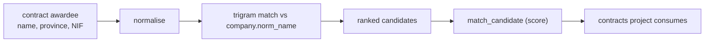

# Feature — Contracts-project integration

## Summary

Let the sibling public-contracts project match its awardees to Mercator companies via a
shared normalised-name + province matcher, surfaced as scored candidates — read-only, with
no write coupling.

## Related specs / ADRs

- Specs: [5 — Link detection](../specs/05-link-detection.md)
- ADRs: [0009 — Probabilistic resolution](../architecture/0009-probabilistic-person-resolution.md), [0008 — Registry coordinates as key](../architecture/0008-registry-coordinates-as-company-natural-key.md), [0013 — API key auth](../architecture/0013-api-key-auth-and-config.md)

## Functional behaviour

- The contracts project consumes Mercator **read-only** (via the read API or a read replica).
  Against the production API it must send a valid **API key** (`X-API-Key`); see
  [ADR-0013](../architecture/0013-api-key-auth-and-config.md).
- **Matching key:** normalised company name + province, using the **same** normalisation
  function as ingestion ([entity-extraction-normalisation](entity-extraction-normalisation.md))
  and `pg_trgm` similarity.
- Because contracts data has **NIFs** but the BORME does **not**, the join cannot be on NIF.
  Mercator clusters companies and contract awardees by normalised name and presents **ranked
  candidate matches** with scores.
- Matches live in a dedicated **`match_candidate`** table (with scores), keeping the two
  projects loosely coupled. It is written **only by a Mercator-internal batch matcher** (a
  derived/materialised table — see [database-schema](database-schema.md)), **not** by the
  contracts project and **not** over HTTP; the contracts project only **reads** it. This is a
  derived table, so it is outside the "two write paths" *ingestion* invariant
  ([ADR-0006](../architecture/0006-hybrid-write-path.md)) — there is still no write coupling
  between the two projects.

## Data flow

## Inputs / outputs

- **Input:** contract awardee identifiers (name + province; NIF retained on the contracts
  side).
- **Output:** ranked Mercator company candidates with match scores in `match_candidate`.

## Edge cases

- **Name-only ambiguity** — multiple plausible companies; return ranked candidates, never a
  forced single match.
- **Normalisation drift** — both sides MUST share one normalisation definition, or matches
  silently degrade.
- **No match** — recorded as such; not an error.

## Acceptance criteria

- Awardees match to ranked company candidates using the shared normaliser.
- The contracts project never writes to Mercator; coupling is read-only.
- Scores are calibrated and exposed; ambiguous cases stay candidates.

## Implementation issues

- [ ] `match_candidate` table + scoring schema.
- [ ] Internal batch matcher + its refresh trigger (e.g. after each daily incremental, or on
      demand) — defines when candidates are (re)computed; the contracts project never pushes.
- [ ] Shared normaliser exposed/usable from the matcher (parity with ingestion).
- [ ] Name+province trigram matcher producing ranked candidates.
- [ ] Read-only access path for the contracts project (API or read replica).
- [ ] Match-quality evaluation against a labelled sample.
