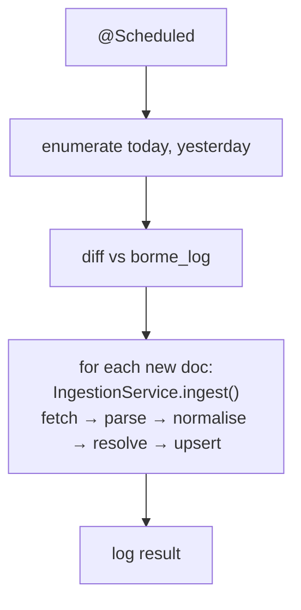

# Feature — Daily incremental

## Summary

An in-server scheduled job (Micronaut `@Scheduled`) that each publication day fetches the new
BORME documents and persists them directly to PostgreSQL via the shared `IngestionService`.

## Related specs / ADRs

- Specs: [2 — Ingestion](../specs/02-ingestion.md)
- ADRs: [0005 — Three Java modules](../architecture/0005-java-ingester-and-read-api.md), [0006 — Write paths](../architecture/0006-hybrid-write-path.md), [0017 — Observability & alerting](../architecture/0017-observability-logging-and-alerting.md)

## Functional behaviour

- A **Micronaut `@Scheduled`** bean in the `server` runs on publication days. It enumerates
  the summaries for **today and yesterday** (to catch late publication) via
  [summary-enumeration](summary-enumeration.md).
- It diffs the enumerated documents against `borme_log` and processes only those not yet
  `MERGED`.
- For each new document it calls the **shared `IngestionService`** (the same code the backfill
  uses): fetch ([document-fetch](document-fetch.md)), parse ([act-parsing](act-parsing.md)),
  normalise ([entity-extraction-normalisation](entity-extraction-normalisation.md)), resolve
  ([entity-resolution](entity-resolution.md)) and upsert — **in-process, directly to the DB**
  (no HTTP). Volume is a few dozen documents, so row-by-row is fine.
- After processing the day's documents, it runs the **errata reconciliation pass** — re-attempting
  `act_correction` rows still `UNAPPLIED` (a correction published before its target, or whose
  target arrived in a later run) — identically to the backfill. Idempotent via the applied-marker
  guard.
- It logs outcomes, **records a last-success heartbeat** for staleness detection, and surfaces
  low-confidence person matches for review
  ([ADR-0017](../architecture/0017-observability-logging-and-alerting.md)).

## Data flow

## Inputs / outputs

- **Input:** the current date (and previous); DB connection; schedule config.
- **Output:** new acts persisted directly to the DB; `borme_log` updated; an alert/log for
  failures and low-confidence matches.

## Edge cases

- **Non-publication day** — enumeration returns nothing; job exits cleanly.
- **Late-published documents** — covered by re-checking yesterday.
- **Overlapping runs** — guard against concurrent execution (scheduler lock / run guard).
- **Already-processed document** — skipped via `borme_log`; DB UNIQUE + `ON CONFLICT DO
  NOTHING` is the backstop.
- **Transient BOE/DB failure** — safe to retry next tick; idempotent by document id.

## Acceptance criteria

- Runs unattended inside the server; processes a day's new documents end to end.
- Re-running (or a double-tick) the same day is a no-op (idempotent).
- Uses the exact shared `IngestionService` — no daily-only resolution code.
- Runs green for a week to graduate.

## Implementation issues

- [ ] Micronaut `@Scheduled` daily job + concurrency/run guard.
- [ ] Today+yesterday enumeration and `borme_log` diffing.
- [ ] Wire the job to the shared `IngestionService` (built in
      [entity-resolution](entity-resolution.md); in-process upsert).
- [ ] Errata reconciliation pass over `UNAPPLIED` corrections (shared with backfill).
- [ ] Outcome logging + last-success heartbeat + low-confidence-match alerting ([ADR-0017](../architecture/0017-observability-logging-and-alerting.md)).
- [ ] Operational runbook (what to do on persistent failures).
