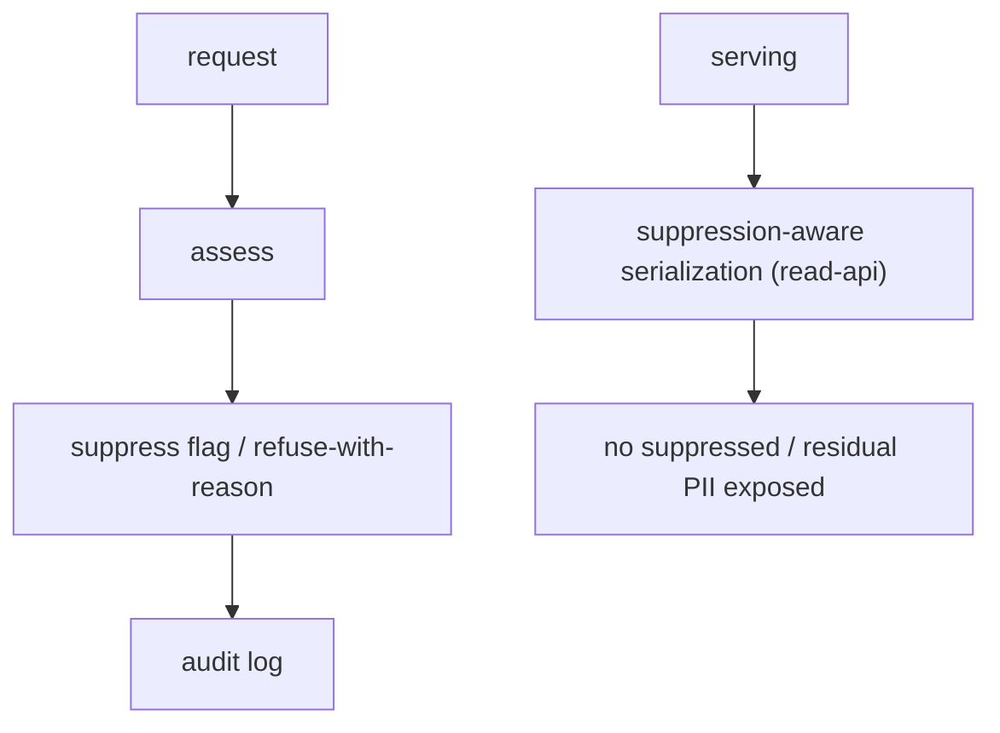

# Feature — Data protection

## Summary

The concrete mechanisms that meet Mercator's controller obligations: privacy notice, an
erasure/suppression workflow, an audit log, and suppression of residual identifiers.

## Related specs / ADRs

- Specs: [7 — Data protection](../specs/07-data-protection.md)
- ADRs: [0011 — Cheap EU VPS hosting](../architecture/0011-cheap-eu-vps-hosting.md) (EU residency)

## Functional behaviour

- **Privacy notice** — a published policy stating what personal data is processed, the
  lawful basis (legitimate interest / public-interest transparency), the source (BORME), and
  data-subject rights and contact.
- **Suppression flag** — entities (esp. persons) can be flagged suppressed; suppressed
  personal data is excluded from API responses and from indexing, while the underlying act
  record remains for integrity (the public fact stays at the BOE).
- **Erasure/suppression workflow** — a documented process to receive, assess and action
  Art. 17 requests, with the right to refuse outright deletion (lawful public source) but the
  ability to suppress/limit visibility on justified request.
- **Audit log** — every erasure/suppression request and decision is logged.
- **Residual identifier suppression** — DNI/NIE in older entries are stripped at extraction
  ([entity-extraction-normalisation](entity-extraction-normalisation.md)) and never surfaced.
- **Source attribution / non-authenticity** — responses/UX cite the BORME and disclaim
  authenticity.

## Data flow

## Inputs / outputs

- **Input:** data-subject requests; configuration of the privacy policy.
- **Output:** suppression state honoured across the API; an auditable decision trail.

## Edge cases

- **Suppressed person still present in source** — Mercator suppresses its copy; does not
  claim to alter the BOE.
- **Re-ingestion re-introducing suppressed data** — suppression must persist across
  re-ingest (keyed independently of act rows).
- **Over-broad requests** — assessed against the lawful-basis criteria, refusable with
  reasons.

## Acceptance criteria

- Privacy notice published; suppression hides personal data from all read paths.
- DNI/NIE never appear in output.
- Erasure/suppression decisions are logged; suppression survives re-ingestion.

## Implementation issues

- [ ] Suppression flag model + suppression-aware serialization in [read-api](read-api.md).
- [ ] Suppression persistence across re-ingestion.
- [ ] DNI/NIE suppression verified end to end.
- [ ] Erasure/suppression request workflow + audit log.
- [ ] Published privacy policy + source-attribution/non-authenticity notices.
