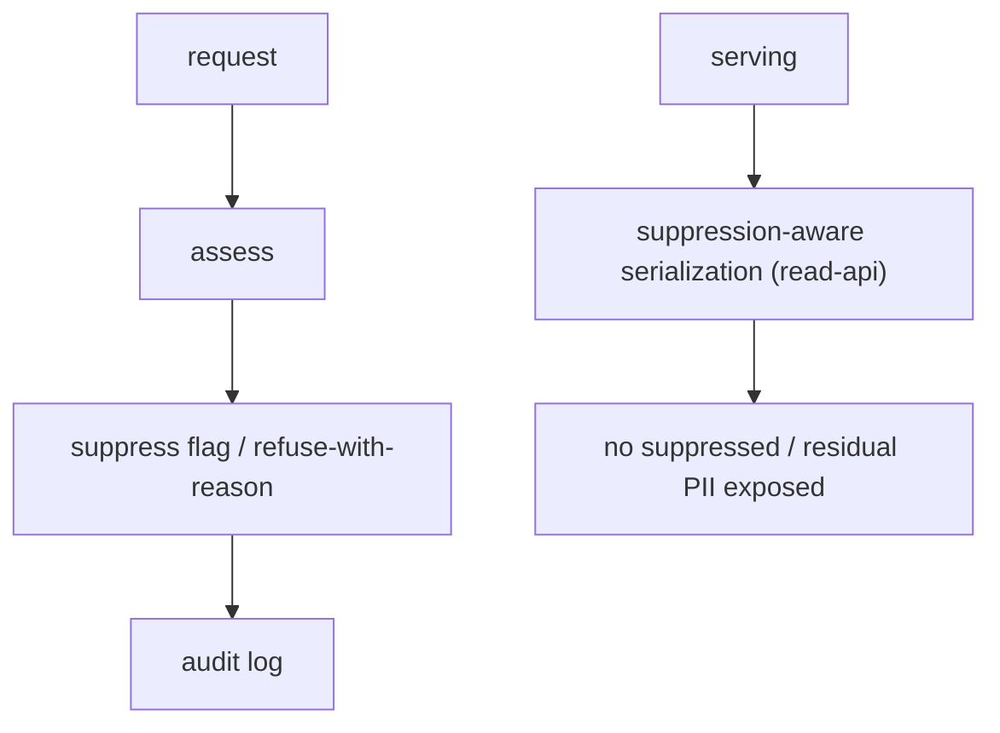

# Feature — Data protection

## Summary

The concrete mechanisms that meet Mercator's controller obligations: privacy notice, an
erasure/suppression workflow, an audit log, and suppression of residual identifiers.

## Related specs / ADRs

- Specs: [7 — Data protection](../specs/07-data-protection.md)
- ADRs: [0011 — Cheap EU VPS hosting](../architecture/0011-cheap-eu-vps-hosting.md) (EU residency), [0021 — BORME data reuse & attribution](../architecture/0021-borme-data-reuse-and-attribution.md), [0019 — Backup, restore & retention](../architecture/0019-backup-restore-and-retention.md)

## Functional behaviour

- **Privacy notice** — a published policy stating what personal data is processed, the
  lawful basis (legitimate interest / public-interest transparency), the source (BORME), and
  data-subject rights and contact.
- **Suppression flag (serve-time filter, persisted independently)** — a suppression decision
  lives in the `suppression` table keyed independently of act rows (so it survives re-ingestion)
  and is mirrored onto a `suppressed` boolean on `person`/`company` (see
  [database-schema](database-schema.md)). The read layer **filters suppressed rows out of every
  result** (`WHERE NOT suppressed`) — search, detail and links alike — so they are treated as
  not-present rather than returned as redacted stubs. (The GIN trigram index is not "removed per
  row"; suppression is enforced by the query filter, optionally backed by a partial index
  `WHERE NOT suppressed`.) The underlying act record remains for integrity — the public fact
  stays at the BOE.
- **Erasure/suppression workflow** — a documented process to receive, assess and action
  Art. 17 requests, with the right to refuse outright deletion (lawful public source) but the
  ability to suppress/limit visibility on justified request.
- **Audit log** — every erasure/suppression request and decision is logged.
- **Residual identifier suppression** — DNI/NIE in older entries are detected (pattern +
  control-letter check) and **dropped at extraction**, never persisted
  ([entity-extraction-normalisation](entity-extraction-normalisation.md)); the read layer keeps
  a backstop filter so any that slip through are never surfaced. (Distinct from named-individual
  suppression above, which is a serve-time filter on a *persisted* flag, not destruction.)
- **Source attribution / non-authenticity** — responses/UX cite the BORME and disclaim
  authenticity.

## Data flow

## Inputs / outputs

- **Input:** data-subject requests; configuration of the privacy policy.
- **Output:** suppression state honoured across the API; an auditable decision trail.

## Edge cases

- **Suppressed person still present in source** — Mercator suppresses its copy; does not
  claim to alter the BOE.
- **Re-ingestion re-introducing suppressed data** — suppression must persist across
  re-ingest (keyed independently of act rows).
- **Over-broad requests** — assessed against the lawful-basis criteria, refusable with
  reasons.

## Acceptance criteria

- Privacy notice published; suppression hides personal data from all read paths.
- DNI/NIE never appear in output.
- Erasure/suppression decisions are logged; suppression survives re-ingestion.

## Implementation issues

- [ ] `suppression` table (independent of act rows) + `suppressed` flag mirror + serve-time
      filtering (and optional partial index) in [read-api](read-api.md).
- [ ] Suppression persistence across re-ingestion (re-read from `suppression` on every merge).
- [ ] DNI/NIE detection (pattern + control-letter) dropped at extraction + serve backstop, verified end to end.
- [ ] Erasure/suppression request workflow + `erasure_log` audit table.
- [ ] Written **Legitimate Interests Assessment (LIA)** + published privacy policy +
      source-attribution/non-authenticity notices ([ADR-0021](../architecture/0021-borme-data-reuse-and-attribution.md)).
- [ ] Retention windows for raw cache / `erasure_log` / backups ([ADR-0019](../architecture/0019-backup-restore-and-retention.md)).
- [ ] Pre-launch: confirm BOE `robots.txt` permits the chosen paths + re-read the reuse notice.
