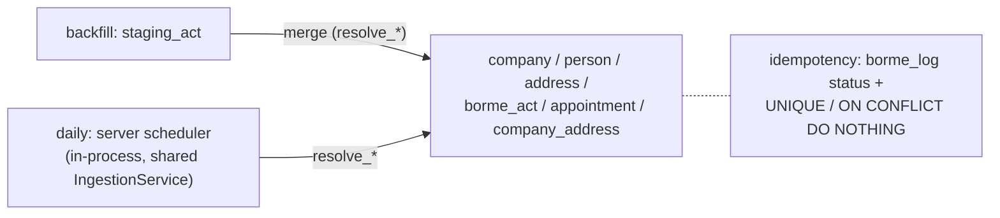

# Feature — Database schema

## Summary

The PostgreSQL schema: live entity tables, staging tables for backfill, the `borme_log`,
required extensions, indexes, and the UNIQUE/temporal constraints that enforce idempotency
and history.

## Related specs / ADRs

- Specs: [2 — Ingestion](../specs/02-ingestion.md), [4 — Data model](../specs/04-data-model.md)
- ADRs: [0004 — PostgreSQL](../architecture/0004-postgresql-as-primary-datastore.md), [0006 — Hybrid write path](../architecture/0006-hybrid-write-path.md), [0008 — Registry coordinates as key](../architecture/0008-registry-coordinates-as-company-natural-key.md), [0015 — Auto-apply Fe de erratas](../architecture/0015-auto-apply-fe-de-erratas-corrections.md)

## Functional behaviour

Extensions: `pg_trgm`, `fuzzystrmatch`, `unaccent`.

Live tables (conceptual columns; see [Spec 4](../specs/04-data-model.md)):

- **company** — `raw_name`, `norm_name`, `legal_form`, `province_code`, `reg_hoja`,
  `reg_tomo`, `first_seen`, `last_seen`, `name_match_flag` (set when created without a Hoja —
  see resolution policy below), `suppressed` (boolean, default false),
  **`status`** (`ACTIVE` | `DISSOLVED` | `EXTINCT` | `MERGED`, default `ACTIVE` — updated by
  `DISOLUCION`, `EXTINCION`, `FUSION`, and `REAPERTURA` acts; `REAPERTURA` resets back to
  `ACTIVE`);
  `UNIQUE (reg_hoja, province_code)`; `GIN (norm_name gin_trgm_ops)`.
  *(Postgres does **not** enforce uniqueness across `NULL` `reg_hoja`, so the constraint governs
  only Hoja-bearing rows; null-Hoja companies are never auto-deduped — they are create-and-flagged
  and reconciled via `match_candidate` review, per [entity-resolution](entity-resolution.md).)*
- **person** — `raw_name`, `norm_name`, `suppressed` (boolean, default false);
  `GIN (norm_name gin_trgm_ops)`.
- **address** — `raw_text`, `norm_text`, `municipality`, `province_code`;
  `UNIQUE (norm_text, province_code)` (stable `address_id` for shared-address joins via
  `resolve_address`); `GIN (norm_text gin_trgm_ops)` for fuzzy search.
- **borme_act** — `borme_id`, `cve`, `pub_date`, `province_code`, `company_id`, `act_type`,
  `datos_registrales`, **`inscripcion`** (the Inscripción/Asiento number parsed from the act —
  the key errata corrections match on), **`doc_seq`** (deterministic 0-based ordinal of the act
  block within its document, assigned by the splitter in reading order), `raw_block`;
  `UNIQUE (borme_id, company_id, act_type, datos_registrales, doc_seq)` for idempotency.
  *(`doc_seq` is the discriminator that keeps two legitimately distinct acts of the **same**
  `act_type` sharing one `datos_registrales` in one document — e.g. two ceses — from colliding
  under `ON CONFLICT DO NOTHING`, while re-processing the same document still produces the same
  `doc_seq` ordering and so remains a true no-op.)*
- **appointment** — `company_id`, `person_id`, `role`, `event_type`, `act_id`, `valid_from`,
  `valid_to`.
- **company_address** — `company_id`, `address_id`, `valid_from`, `valid_to`.
- **act_correction** — the audit trail for *Fe de erratas* ([ADR-0015](../architecture/0015-auto-apply-fe-de-erratas-corrections.md)):
  `errata_act_id` (the `FE_ERRATAS` `borme_act`); the **target locator** as a single canonical
  pair `target_company_id` + `target_inscripcion` (the company + Inscripción the errata prose
  references — the same key the target matcher uses); the **resolved** `target_act_id`
  (nullable — `NULL` until/unless the target act is found); `field`, `old_value`, `new_value`,
  `status` (APPLIED|UNAPPLIED), `flag_reason`. The locator and the resolved id are kept distinct
  so an as-yet-unmatched correction still records *what* it points at. Lets a correction be
  traced and reversed; the pre-correction value is never lost. *(This is the one authoritative
  representation of the target reference — [act-parsing](act-parsing.md) and
  [errata-corrections](errata-corrections.md) describe the parse/match that populate it.)*

Derived / cross-cutting tables (written by Mercator-internal jobs, **not** by the BORME
ingestion write paths and **never** over HTTP — so the "two write paths" ingestion invariant
([ADR-0006](../architecture/0006-hybrid-write-path.md)) is unaffected):

- **match_candidate** — ranked name+province matches between Mercator companies and external
  awardees ([contracts-integration](contracts-integration.md)): `company_id`, `external_ref`,
  `external_source`, `score`, `computed_at`. Populated by an internal batch matcher; the
  contracts project only **reads** it (no write coupling).
- **suppression** — GDPR suppression/erasure decisions, keyed **independently of act rows** so
  they survive re-ingestion and the backfill→merge rebuild: `subject_type` (person|company|
  identifier), `subject_ref` (e.g. a salted hash of a DNI/NIE, or a `person_id`), `reason`,
  `created_at`, `actor`. The ingestion path consults this on every resolve and sets the live
  row's `suppressed` flag; a re-ingested row is re-suppressed from this table, not from the
  (transient) act text. See [data-protection](data-protection.md).
- **erasure_log** — append-only audit of every suppression/erasure request and the decision
  taken (`request`, `decision`, `subject_ref`, `actor`, `at`); retained per the retention
  policy ([Spec 7](../specs/07-data-protection.md)).

Backfill-only tables:

- **staging_act** — raw parsed rows (no FKs, no resolution): company raw/norm name, legal
  form, `reg_hoja`/`reg_tomo`, `act_type`, `datos_registrales`, `inscripcion`, `doc_seq`,
  domicilio raw/norm + municipality, `appointments JSONB`, `loaded_at`, `processed`.
- **borme_log** — `borme_id` PK, `pub_date`, `status`
  (FETCHED|PARSED|MERGED|SKIPPED|ERROR), `error_kind` (RETRYABLE|PERMANENT, set only on
  ERROR), `source_path` (`backfill`|`daily_incremental`), `error_detail`, `processed_at`.
  *(`SKIPPED` = non-publication day or a 200-but-empty / no-Sección-A summary; `source_path`
  has no `api_ingest` value — there is no HTTP ingest, [ADR-0006](../architecture/0006-hybrid-write-path.md).)*

## Data flow

## Inputs / outputs

- **Input:** normalised records (staging rows for backfill, in-process records for daily).
- **Output:** the persisted relational model that the read API and link queries serve.

## Edge cases

- **Duplicate document processing** — `borme_act` UNIQUE (incl. `doc_seq`) + `ON CONFLICT DO
  NOTHING`; re-processing a whole document is a no-op.
- **Two same-type acts, one `datos_registrales`** — e.g. two ceses in one block: distinguished
  by `doc_seq`, so neither is silently dropped (the pre-`doc_seq` key would have collided).
- **Temporal updates** — a new nombramiento/domicilio closes the prior interval's
  `valid_to`.
- **Null `reg_hoja`** — cannot use the natural key; the `UNIQUE (reg_hoja, province_code)`
  constraint does not constrain nulls, so null-Hoja rows are **never** auto-deduped — resolution
  create-and-flags (`name_match_flag`) and records a `match_candidate` for review rather than
  silent name-merge ([entity-resolution](entity-resolution.md), [ADR-0008](../architecture/0008-registry-coordinates-as-company-natural-key.md)).
- **Schema migrations** — managed by Flyway ([ADR-0016](../architecture/0016-database-schema-migrations.md));
  adding act types adds enum values/payload, not core tables.
- **Errata target missing** — a `FE_ERRATAS` whose target act is not present is stored with
  `act_correction.status = UNAPPLIED` + `flag_reason`, not dropped; retried by the
  unapplied-correction reconciliation pass (see [errata-corrections](errata-corrections.md)).
- **Re-ingestion vs suppression** — a rebuilt/re-merged row re-reads the `suppression` table and
  re-applies `suppressed`, so an erasure decision is never undone by re-ingestion.

## Acceptance criteria

- Migrations create all tables, extensions and indexes from clean.
- Re-inserting the same act is a no-op (idempotent).
- Temporal queries ("administrators on date X") resolve correctly against the intervals.

## Implementation issues

- [x] Migration: extensions + live tables (incl. `borme_act.inscripcion`/`doc_seq`,
      `company.suppressed`/`name_match_flag`, `person.suppressed`) + indexes + UNIQUE constraints.
- [x] Migration: `staging_act` + `borme_log` (status incl. SKIPPED, `error_kind`, `source_path`).
- [x] Migration: `act_correction` audit table (canonical target locator + resolved `target_act_id`).
- [x] Migration: `match_candidate` derived table + scoring columns.
- [x] Migration: `suppression` + `erasure_log` data-protection tables (independent of act rows).
- [x] Temporal-interval handling (close previous `valid_to` on new event/address).
- [x] Idempotency constraints (incl. `doc_seq` discriminator) + `ON CONFLICT DO NOTHING` patterns.
- [x] Migration tooling/runner (Flyway) wired into deployment ([ADR-0016](../architecture/0016-database-schema-migrations.md)).
- [x] Seed/reference data (province codes).
- [ ] Role enum: `appointment.role` constraint/seed table (deferred — BORME role vocabulary needs bormeparser dictionary port first).
- [ ] Migration: `company.status` column (`ACTIVE`|`DISSOLVED`|`EXTINCT`|`MERGED`, default `ACTIVE`; CHECK constraint) — set by `DISOLUCION`, `EXTINCION`, `FUSION`, `REAPERTURA` act ingestion.
