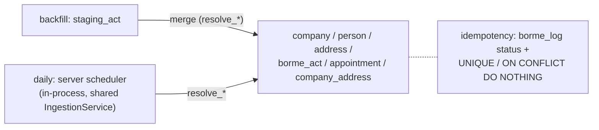

# Feature — Database schema

## Summary

The PostgreSQL schema: live entity tables, staging tables for backfill, the `borme_log`,
required extensions, indexes, and the UNIQUE/temporal constraints that enforce idempotency
and history.

## Related specs / ADRs

- Specs: [2 — Ingestion](../specs/02-ingestion.md), [4 — Data model](../specs/04-data-model.md)
- ADRs: [0004 — PostgreSQL](../architecture/0004-postgresql-as-primary-datastore.md), [0006 — Hybrid write path](../architecture/0006-hybrid-write-path.md), [0008 — Registry coordinates as key](../architecture/0008-registry-coordinates-as-company-natural-key.md)

## Functional behaviour

Extensions: `pg_trgm`, `fuzzystrmatch`, `unaccent`.

Live tables (conceptual columns; see [Spec 4](../specs/04-data-model.md)):

- **company** — `raw_name`, `norm_name`, `legal_form`, `province_code`, `reg_hoja`,
  `reg_tomo`, `first_seen`, `last_seen`; `UNIQUE (reg_hoja, province_code)`;
  `GIN (norm_name gin_trgm_ops)`.
- **person** — `raw_name`, `norm_name`; `GIN (norm_name gin_trgm_ops)`.
- **address** — `raw_text`, `norm_text`, `municipality`, `province_code`;
  `UNIQUE (norm_text, province_code)` (stable `address_id` for shared-address joins via
  `resolve_address`); `GIN (norm_text gin_trgm_ops)` for fuzzy search.
- **borme_act** — `borme_id`, `cve`, `pub_date`, `province_code`, `company_id`, `act_type`,
  `datos_registrales`, `raw_block`;
  `UNIQUE (borme_id, company_id, act_type, datos_registrales)` for idempotency.
- **appointment** — `company_id`, `person_id`, `role`, `event_type`, `act_id`, `valid_from`,
  `valid_to`.
- **company_address** — `company_id`, `address_id`, `valid_from`, `valid_to`.

Backfill-only tables:

- **staging_act** — raw parsed rows (no FKs, no resolution): company raw/norm name, legal
  form, `reg_hoja`/`reg_tomo`, `act_type`, `datos_registrales`, domicilio raw/norm +
  municipality, `appointments JSONB`, `loaded_at`, `processed`.
- **borme_log** — `borme_id` PK, `pub_date`, `status` (FETCHED|PARSED|MERGED|ERROR),
  `source_path` (direct_backfill|api_ingest), `error_detail`, `processed_at`.

## Data flow

## Inputs / outputs

- **Input:** normalised records (staging rows for backfill, in-process records for daily).
- **Output:** the persisted relational model that the read API and link queries serve.

## Edge cases

- **Duplicate document processing** — `borme_act` UNIQUE + `ON CONFLICT DO NOTHING`.
- **Temporal updates** — a new nombramiento/domicilio closes the prior interval's
  `valid_to`.
- **Null `reg_hoja`** — cannot use the natural key; handled by resolution policy (flag, not
  silent name-merge).
- **Schema migrations** — adding act types adds enum values/payload, not core tables.

## Acceptance criteria

- Migrations create all tables, extensions and indexes from clean.
- Re-inserting the same act is a no-op (idempotent).
- Temporal queries ("administrators on date X") resolve correctly against the intervals.

## Implementation issues

- [ ] Migration: extensions + live tables + indexes + UNIQUE constraints.
- [ ] Migration: `staging_act` + `borme_log`.
- [ ] Temporal-interval handling (close previous `valid_to` on new event/address).
- [ ] Idempotency constraints + `ON CONFLICT DO NOTHING` upsert patterns.
- [ ] Migration tooling/runner wired into deployment.
- [ ] Seed/reference data (province codes, role enum).
