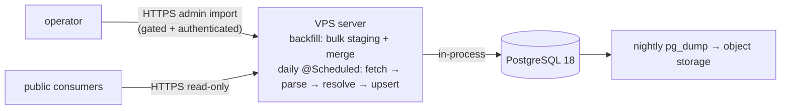

# Feature — Deployment & operations

## Summary

How Mercator is packaged, hosted, scheduled and backed up: a Dockerised PostgreSQL 18 + the
single Micronaut server on a single EU VPS (read API, daily scheduler, and the gated
historical-import endpoint), and nightly off-host backups.

## Related specs / ADRs

- Specs: [8 — Non-functional requirements](../specs/08-non-functional.md)
- ADRs: [0011 — Cheap EU VPS hosting](../architecture/0011-cheap-eu-vps-hosting.md), [0005 — Single Micronaut module](../architecture/0005-java-ingester-and-read-api.md), [0013 — API key auth & config](../architecture/0013-api-key-auth-and-config.md), [0016 — Schema migrations](../architecture/0016-database-schema-migrations.md), [0017 — Observability & alerting](../architecture/0017-observability-logging-and-alerting.md), [0019 — Backup, restore & retention](../architecture/0019-backup-restore-and-retention.md), [0020 — Secrets management](../architecture/0020-secrets-management.md)

## Functional behaviour

- **Topology:** one EU VPS (~€7/mo class, e.g. Hetzner CX32) runs **PostgreSQL 18** (with
  `pg_trgm`/`fuzzystrmatch`/`unaccent`) and the **Java 25 + Micronaut server**, each in Docker.
  The single server hosts the **read-only API**, the **in-process daily-incremental scheduler**,
  and the **gated historical-import endpoint** (disabled by default, authenticated). There is no
  separate ingester process or artifact.
- **Configuration:** environment-driven / 12-factor (DB connection, BOE rate limits,
  daily-schedule cron expression, cache location, **API keys**), via env vars + Micronaut
  environments (`dev`/`prod`). The same image runs everywhere; **secrets (API keys, DB
  password, backup-storage credentials) are injected at run time** from a root-owned, gitignored
  `.env` (chmod 600) consumed by Compose — never committed or baked into the image
  ([ADR-0013](../architecture/0013-api-key-auth-and-config.md),
  [ADR-0020](../architecture/0020-secrets-management.md)).
- **Scheduling:** the daily incremental is a **Micronaut `@Scheduled`** job inside the server
  ([daily-incremental](daily-incremental.md)) — no external cron/systemd timer. The historical
  backfill is run on demand by enabling the config toggle and calling the **admin import
  endpoint** (by date/month), then disabling the toggle again; it runs in-server over several
  days ([historical-backfill](historical-backfill.md)).
- **Backups:** nightly **encrypted** `pg_dump` shipped to **EU cold object storage**, with a
  **rehearsed restore** and a retention window ([ADR-0019](../architecture/0019-backup-restore-and-retention.md));
  the BOE is a slower last-resort fallback (a full re-crawl is multi-day under the rate limit).
- **Network:** the server exposes the **read-only** public API behind TLS (reverse proxy /
  Let's Encrypt), which in production requires an **API key** (`X-API-Key`). The only write
  surface is the **admin import endpoint**, which is **disabled by default** and **always
  authenticated** — and is best left disabled (and/or not proxied publicly) outside a backfill
  window. Only the liveness/readiness probe paths are unauthenticated, and they expose just
  up/down.
- **Reproducibility:** a project-authored `docker-compose` brings up the server stack —
  **PostgreSQL 18 + the Micronaut server only**; there is **no second datastore** (no
  Elasticsearch/search engine — PostgreSQL `pg_trgm` covers fuzzy search, per
  [ADR-0004](../architecture/0004-postgresql-as-primary-datastore.md)). The build is a
  **single-project Gradle 9.5** build producing one server artifact.
- **Resource sizing & performance:** the box hosts PostgreSQL **and** the Micronaut JVM, so
  PostgreSQL (`shared_buffers`, `work_mem`) and the JVM heap are sized **together** — the
  GIN/trigram working set and the API process must coexist **without swapping**. This is a
  tuning task, not a fixed assumption ([Spec 8 § Performance](../specs/08-non-functional.md)).
  The **~1 s p95** default-link-query latency target is owned by
  [Spec 8](../specs/08-non-functional.md) and benchmarked in [link-queries](link-queries.md);
  **link-query latency and `work_mem` pressure are tracked in production** so the Apache AGE
  escalation ([ADR-0010](../architecture/0010-postgresql-ctes-over-graph-db.md)) stays a
  *measured* decision ([ADR-0017](../architecture/0017-observability-logging-and-alerting.md)).

## Data flow

## Inputs / outputs

- **Input:** VPS, container images, env config, object-storage credentials.
- **Output:** a running read-only API + database with an in-server daily scheduler; recurring
  backups.

## Edge cases

- **Single point of failure** — mitigated by off-host backups + re-ingestability.
- **Disk growth** — monitor; corpus is tens of GB, but caches grow; size disk/volume with
  headroom.
- **Price/region changes** — confirm VPS rates/region at order time; keep data in the EU.
- **Migration runs** — Flyway migrations applied on deploy
  ([ADR-0016](../architecture/0016-database-schema-migrations.md), [database-schema](database-schema.md)).
  On a single node there is **no blue/green**, so migrations are **forward-only and
  backward-compatible**, and a known-good backup is taken **before** each deploy as the rollback
  path ([ADR-0019](../architecture/0019-backup-restore-and-retention.md)).
- **Scheduler on redeploy** — ensure the daily job does not double-run across a rolling
  restart (run guard / single instance).
- **Silent job failure** — the nightly incremental could stop unnoticed; a last-success
  heartbeat + dead-man's-switch alert covers it
  ([ADR-0017](../architecture/0017-observability-logging-and-alerting.md)).
- **Memory pressure / swapping** — the shared 8 GB box runs PostgreSQL **and** the JVM;
  `shared_buffers`/`work_mem` and the heap are co-sized and swap is watched, since swapping
  would blow the ~1 s p95 latency target ([Spec 8 § Performance](../specs/08-non-functional.md)).

## Acceptance criteria

- The server stack comes up reproducibly from compose with all extensions enabled.
- PostgreSQL and the JVM coexist on the box **without swapping**; default link queries meet the
  **~1 s p95** target, and query latency + `work_mem` pressure are observable in production.
- The in-server daily job runs on schedule; nightly backups land in object storage and restore.
- The public surface is read-only; the admin import endpoint is absent (`404`) when disabled and
  rejects unauthenticated requests (`401`).
- In production, unauthenticated API requests are rejected (`401`); no secret is present in
  the image or repo (injected at run time).

## Implementation issues

- [ ] Single-project Gradle 9.5 build (one server artifact) + wrapper.
- [ ] Production config: inject API key(s) + DB password as runtime secrets; set the `prod`
      Micronaut environment; verify auth is on by default.
- [ ] `docker-compose` for PostgreSQL 18 + server with extensions enabled.
- [ ] Environment-based configuration for all components.
- [ ] Flyway migration step wired into deploy (forward-only; pre-deploy backup as rollback).
- [ ] Micronaut `@Scheduled` daily job config (cron expression, run guard).
- [ ] Nightly **encrypted** `pg_dump` to EU object storage + **rehearsed** restore + retention.
- [ ] Reverse proxy + TLS (Let's Encrypt) in front of the read API.
- [ ] Memory-budget tuning: co-size PostgreSQL (`shared_buffers`/`work_mem`) and the JVM heap
      for the ~8 GB box so the GIN/trigram working set + API process run without swapping
      ([Spec 8 § Performance](../specs/08-non-functional.md)).
- [ ] Monitoring/alerting: disk, daily-job heartbeat/dead-man's-switch, API health, and
      **link-query latency + `work_mem` pressure** (the AGE-escalation decision input)
      ([ADR-0017](../architecture/0017-observability-logging-and-alerting.md)).
