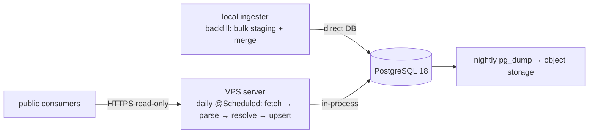

# Feature — Deployment & operations

## Summary

How Mercator is packaged, hosted, scheduled and backed up: a Dockerised PostgreSQL 18 + the
Micronaut server on a single EU VPS, the offline `ingester` run locally, and nightly off-host
backups.

## Related specs / ADRs

- Specs: [8 — Non-functional requirements](../specs/08-non-functional.md)
- ADRs: [0011 — Cheap EU VPS hosting](../architecture/0011-cheap-eu-vps-hosting.md), [0005 — Three Java modules](../architecture/0005-java-ingester-and-read-api.md)

## Functional behaviour

- **Topology:** one EU VPS (~€7/mo class, e.g. Hetzner CX32) runs **PostgreSQL 18** (with
  `pg_trgm`/`fuzzystrmatch`/`unaccent`) and the **Java 25 + Micronaut server** (read-only API
  **plus** the in-process daily-incremental scheduler), each in Docker. The **Java `ingester`**
  (historical backfill) runs locally/off-server.
- **Configuration:** environment-driven / 12-factor (DB connection, BOE rate limits,
  daily-schedule cron expression, cache location, **API keys**), via env vars + Micronaut
  environments (`dev`/`prod`). The same image runs everywhere; **secrets (API keys, DB
  password) are injected at run time** (Docker/K8s secret or cloud secret manager), never
  committed or baked into the image ([ADR-0013](../architecture/0013-api-key-auth-and-config.md)).
- **Scheduling:** the daily incremental is a **Micronaut `@Scheduled`** job inside the server
  ([daily-incremental](daily-incremental.md)) — no external cron/systemd timer. The historical
  backfill is run on demand from the `ingester`, locally, over several days.
- **Backups:** nightly `pg_dump` to object storage; the BOE is always re-ingestable as a
  disaster fallback.
- **Network:** the server exposes only the **read-only** API, which in production requires an
  **API key** (`X-API-Key`); there is no ingest endpoint to isolate. Health/readiness probes
  are unauthenticated.
- **Reproducibility:** `docker-compose` for the server stack (PostgreSQL + server); osbex's
  compose is a template, minus Elasticsearch. The build is a **Gradle 9.5 multi-project**
  (`shared`, `server`, `ingester`).

## Data flow

## Inputs / outputs

- **Input:** VPS, container images, env config, object-storage credentials.
- **Output:** a running read-only API + database with an in-server daily scheduler; recurring
  backups.

## Edge cases

- **Single point of failure** — mitigated by off-host backups + re-ingestability.
- **Disk growth** — monitor; corpus is tens of GB, but caches grow; size disk/volume with
  headroom.
- **Price/region changes** — confirm VPS rates/region at order time; keep data in the EU.
- **Migration runs** — schema migrations applied on deploy ([database-schema](database-schema.md)).
- **Scheduler on redeploy** — ensure the daily job does not double-run across a rolling
  restart (run guard / single instance).

## Acceptance criteria

- The server stack comes up reproducibly from compose with all extensions enabled.
- The in-server daily job runs on schedule; nightly backups land in object storage and restore.
- The public surface is read-only (no write/ingest endpoint reachable).
- In production, unauthenticated API requests are rejected (`401`); no secret is present in
  the image or repo (injected at run time).

## Implementation issues

- [ ] Gradle 9.5 multi-project wiring (`shared`/`server`/`ingester`) + wrapper.
- [ ] Production config: inject API key(s) + DB password as runtime secrets; set the `prod`
      Micronaut environment; verify auth is on by default.
- [ ] `docker-compose` for PostgreSQL 18 + server with extensions enabled.
- [ ] Environment-based configuration for all components.
- [ ] Schema-migration step wired into deploy.
- [ ] Micronaut `@Scheduled` daily job config (cron expression, run guard).
- [ ] Nightly `pg_dump` to object storage + documented restore.
- [ ] Basic monitoring/alerting (disk, job success, API health).
