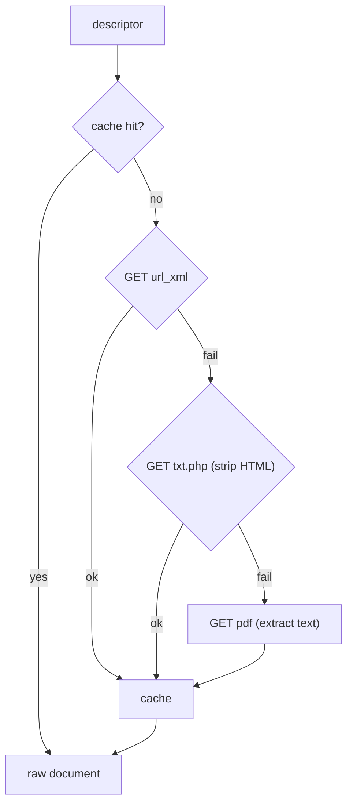

# Feature — Document fetch

## Summary

Fetch each Sección A document as **structured XML** (`url_xml` / `xml.php`), with caching,
polite rate-limiting, and `txt.php`→PDF fallbacks, so the parser always works on cached raw
input.

## Related specs / ADRs

- Specs: [1 — Data sources](../specs/01-data-sources.md), [2 — Ingestion](../specs/02-ingestion.md), [7 — Data protection](../specs/07-data-protection.md)
- ADRs: [0002 — Prefer structured text/XML over PDF](../architecture/0002-structured-xml-over-pdf-parsing.md), [0018 — BOE source politeness & retry](../architecture/0018-boe-source-politeness-and-retry.md)

## Functional behaviour

- For a document descriptor, GET its **`url_xml`** (`xml.php?id=BORME-A-YYYY-NNN-PP`).
- Take the `<metadatos>` (identificador, titulo, seccion, pub date, pages, url_pdf) and the
  `<texto>` body, whose `
`/`
` paragraphs already
  segment the document into company headers and act blocks.
- **Cache** the raw response to disk/object storage keyed by `borme_id`, **tagging the stored
  representation** (`xml` | `txt` | `pdf`) so a re-run knows whether the cached body carries the
  `articulo`/`parrafo` markup the splitter expects, or a degraded fallback. The cache key is
  `borme_id`; the representation tag is part of the entry, not the key.
- Apply the **single shared rate limiter + retry policy**
  ([ADR-0018](../architecture/0018-boe-source-politeness-and-retry.md)) — one global ≤1–2 req/s
  token bucket shared with [summary-enumeration](summary-enumeration.md) (not a second,
  independent limiter), exponential backoff + jitter on 429/5xx honouring `Retry-After`, a
  **bounded max-attempts**, and a descriptive **User-Agent**. On final give-up the document is
  recorded in `borme_log` as `ERROR` with `error_kind` RETRYABLE or PERMANENT.
- **Fallback order on failure:** `txt.php` (`url_html`, strip HTML chrome) → **PDF**
  (`url_pdf`, extract text). PDF remains the authentic last resort. PDF text extraction uses a
  lightweight JVM PDF library (e.g. Apache PDFBox) — **not** bormeparser, which is reference-only
  ([ADR-0012](../architecture/0012-reuse-bormeparser-dictionaries-gpl.md)).

## Data flow

## Inputs / outputs

- **Input:** document descriptor `{borme_id, url_xml, url_html, url_pdf}`.
- **Output:** the document's XML (or fallback text), plus a cache entry; a fetch-error record
  on total failure.

## Edge cases

- **`xml.php` missing/empty for a document** — fall back to `txt.php`, then PDF.
- **`txt.php` returns an error page rather than content** — detect and continue to PDF.
- **Encoding** — preserve Spanish characters (Ñ, accents) faithfully into the cache.
- **Large province documents** (Barcelona ~1 MB) — stream/limit memory appropriately.
- **Endpoint change** — `txt.php` is undocumented; fallback + cache contain the blast radius.
- **robots/rate limits** — never exceed the configured rate; respect 429 backoff.

## Acceptance criteria

- Retrieves structured XML for a sample of documents spanning 2009→present.
- Serves from cache on re-run with zero new network requests.
- Falls back txt.php→PDF and still yields parseable input when XML is unavailable.
- Never exceeds the configured request rate; backs off on 429/5xx.

## Implementation issues

- [x] HTTP fetcher with rate limiter, backoff, and User-Agent.
- [x] XML document fetch + parse (`<metadatos>` + `<texto>` paragraphs), encoding-safe.
- [x] Raw-response cache (disk) keyed by `borme_id`, read-through.
- [x] Fetch-error recording integrated with `borme_log`.
- [x] Fallback chain: `txt.php` HTML-strip, then PDF text extraction.
- [x] Optional object-storage cache backend.
