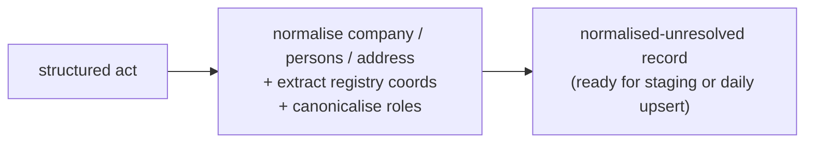

# Feature — Entity extraction & normalisation

## Summary

From parsed acts, produce **normalised-but-unresolved** records: compute normalised names
and keys for companies, persons and addresses, extract registry coordinates, and canonicalise
roles — without ever deciding identity.

## Related specs / ADRs

- Specs: [3 — Extraction](../specs/03-extraction.md), [4 — Data model](../specs/04-data-model.md)
- ADRs: [0007 — Single source of truth for resolution](../architecture/0007-single-source-of-truth-entity-resolution.md)

## Functional behaviour

- **Company normalisation:** `norm_name` = uppercase → `unaccent` → strip legal-form suffix
  → collapse whitespace → remove punctuation. Detect and record `legal_form`.
- **Registry coordinates:** parse Datos registrales into `reg_hoja` (e.g. `PO 67350`),
  `reg_tomo`, libro/folio, inscripción/asiento and date.
- **Person normalisation:** `norm_name` via the same normalisation; keep the raw string
  (name ordering is inconsistent). Persons carry **no identifier**.
- **Address normalisation:** `norm_text` plus best-effort `municipality` and `province_code`.
- **Role canonicalisation:** map every cargo spelling/spacing variant to the canonical enum
  (`ADM_UNICO`, `ADM_SOLIDARIO`, `APODERADO`, …) and the event to
  `NOMBRAMIENTO|CESE|REELECCION|REVOCACION`.
- **No resolution:** this feature **never** decides whether a record matches an existing
  entity — that is [entity-resolution](entity-resolution.md), invoked later by the write
  paths ([ADR-0007](../architecture/0007-single-source-of-truth-entity-resolution.md)).

## Data flow

## Inputs / outputs

- **Input:** structured acts from [act-parsing](act-parsing.md).
- **Output:** normalised records carrying both raw and normalised fields, `reg_hoja`/
  `reg_tomo`, canonical roles/events, and per-appointment person stubs — the shape consumed
  by both write paths.

## Edge cases

- **Surname-first vs name-first** person names — store raw + normalised; do not reorder
  destructively.
- **Company acting as a person-role** — legal-suffix heuristic classifies it as a company.
- **Unparseable Hoja** — emit the record with a null key and flag it (resolution policy
  decides; never silently merge by name — see [ADR-0008](../architecture/0008-registry-coordinates-as-company-natural-key.md)).
- **DNI/NIE present in old entries** — strip from output ([Spec 7](../specs/07-data-protection.md)).

## Acceptance criteria

- A shared normalisation function produces identical output for the ingester and the SQL/Java
  resolution callers (it is reused across the codebase and by [contracts-integration](contracts-integration.md)).
- Registry coordinates extracted correctly for the sample.
- Roles/events map to the canonical enums with no unmapped variants on the sample.

## Implementation issues

- [ ] Canonical normalisation function (upper/unaccent/suffix-strip/collapse) — single shared definition.
- [ ] Legal-form detection + company-vs-person heuristic.
- [ ] Datos registrales parser → `reg_hoja`/`reg_tomo`/libro/folio/IA/date.
- [ ] Role/event canonicalisation tables → enums.
- [ ] Address normalisation (norm_text, municipality, province).
- [ ] DNI/NIE suppression filter.
- [ ] Property-based tests for normalisation idempotency and stability.
