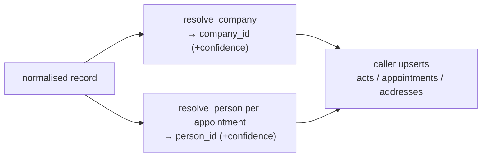

# Feature — Entity resolution

## Summary

The single, shared logic that decides whether a normalised record is a new entity or matches
an existing one — companies by registry key, persons by scored fuzzy matching — invoked
identically by both write paths.

## Related specs / ADRs

- Specs: [4 — Data model](../specs/04-data-model.md), [5 — Link detection](../specs/05-link-detection.md)
- ADRs: [0007 — Single source of truth](../architecture/0007-single-source-of-truth-entity-resolution.md), [0008 — Registry coordinates as key](../architecture/0008-registry-coordinates-as-company-natural-key.md), [0009 — Probabilistic person resolution](../architecture/0009-probabilistic-person-resolution.md)

## Functional behaviour

Implemented as shared PL/pgSQL functions `resolve_company(...)` and `resolve_person(...)`
(see [ADR-0007](../architecture/0007-single-source-of-truth-entity-resolution.md)), wrapped
by the `shared` library's `IngestionService`; the `ingester` backfill merge and the `server`
scheduled daily job both call them — **one definition, both callers**.

- **`resolve_company`** — match on the natural key `(reg_hoja, province_code)` first (exact,
  high confidence). If no Hoja, fall back to normalised-name + province with a high trigram
  threshold, flagged as lower confidence. Get-or-create; update `last_seen`.
- **`resolve_person`** — layered: (1) exact normalised-name match; (2) `pg_trgm` trigram
  similarity (GIN-indexed, threshold ≈0.7+); (3) Jaro-Winkler/Levenshtein
  (`fuzzystrmatch`) for short names where one character matters. Corroborate with
  co-occurrence in the same company/registry. Return a **confidence score**; never hard-merge
  ambiguous persons — surface as candidates
  ([ADR-0009](../architecture/0009-probabilistic-person-resolution.md)).
- **Conservative bias:** a missed merge is a duplicate (recoverable); a wrong merge is
  corruption — prefer not to merge when uncertain.

## Data flow

## Inputs / outputs

- **Input:** a normalised-unresolved record (company stub, person stubs, address).
- **Output:** resolved entity ids with confidence; created entities where no match.

## Edge cases

- **Null/garbled Hoja** — do not merge by name silently; create-and-flag for review.
- **Homonym persons** — distinct people sharing a name must not collapse; corroboration +
  thresholds guard this.
- **Company rename** — natural key (Hoja) keeps identity stable across denominación changes.
- **Threshold tuning** — exposed as configuration; defaults conservative.

## Acceptance criteria

- Identical resolution decisions whether called from the backfill merge or the server's
  scheduled daily job.
- Known same-company acts (same Hoja) resolve to one company across years.
- Person matches carry calibrated confidence; ambiguous cases are flagged, not merged.

## Implementation issues

- [ ] `resolve_company` PL/pgSQL function (Hoja+province key, name fallback, get-or-create).
- [ ] `resolve_person` PL/pgSQL function (exact → trigram → fuzzystrmatch + confidence).
- [ ] Co-occurrence corroboration for person matching.
- [ ] Confidence scoring + low-confidence flagging surfaced to callers.
- [ ] Resolution test suite (golden cases: renames, homonyms, accent/spelling variants).
- [ ] Configurable thresholds + a review queue for flagged matches.
