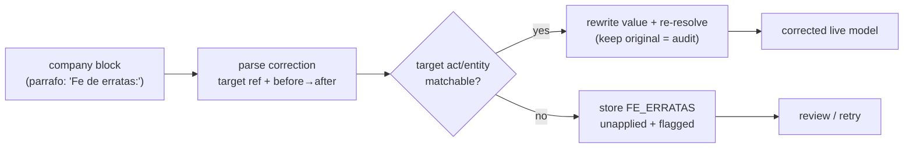

# Feature — Errata corrections (*Fe de erratas*)

## Summary

Recognise BORME errata notices ("Fe de erratas: Se publicó por error…"), parse them into a
structured correction (target reference + erroneous→correct value), and **auto-apply** the fix
to the previously ingested act/entity while keeping an audit trail — falling back to
record-but-flag when the fix cannot be applied confidently.

## Related specs / ADRs

- Specs: [3 — Extraction](../specs/03-extraction.md), [2 — Ingestion](../specs/02-ingestion.md),
  [4 — Data model](../specs/04-data-model.md), [7 — Data protection](../specs/07-data-protection.md)
- ADRs: [0015 — Auto-apply Fe de erratas](../architecture/0015-auto-apply-fe-de-erratas-corrections.md),
  [0007 — Single source of truth for resolution](../architecture/0007-single-source-of-truth-entity-resolution.md),
  [0006 — Hybrid write path](../architecture/0006-hybrid-write-path.md),
  [0009 — Probabilistic person resolution](../architecture/0009-probabilistic-person-resolution.md)

## Functional behaviour

- **Recognition.** A company block whose `
` opens with `Fe de erratas:` is
  classified as a `FE_ERRATAS` act (it reuses the normal `articulo`/`parrafo` markup and ends
  with a `Datos registrales.` footer like any other block).
- **Correction parsing.** From the prose, extract (a) the **target** — the company (its
  `articulo` header → Hoja+province) and the referenced **Inscripción/Asiento** + Datos
  registrales of the publication being corrected — and (b) the **change** — the erroneous
  value and its correct replacement (e.g. `GERAR4DO` → `GERARDO`; old denominación → new). The
  parser emits this as an **unresolved** correction record with the raw block retained; it does
  **not** apply it (the parser never resolves identity, [ADR-0007](../architecture/0007-single-source-of-truth-entity-resolution.md)).
- **Application (shared, both write paths).** The shared `IngestionService` locates the prior
  act / derived row for the same company and Inscripción/Datos registrales and **rewrites the
  erroneous value** to the correct one. Applied identically by the backfill merge and the daily
  incremental ([ADR-0006](../architecture/0006-hybrid-write-path.md)). When the corrected value
  is an entity name, **resolution is re-run** for that entity, which may re-point or re-score a
  probabilistic person ([ADR-0009](../architecture/0009-probabilistic-person-resolution.md)).
- **Audit trail.** The `FE_ERRATAS` act row is always stored, the **pre-correction value is
  preserved**, and the amended row records which errata changed it — traceable and reversible;
  Mercator still never claims authenticity ([Spec 7](../specs/07-data-protection.md)).
- **Fail safe.** If the target cannot be confidently matched, or the change cannot be parsed
  into a clean before→after pair, the errata is stored **unapplied and flagged** and logged for
  review/retry — never guessed.
- **Idempotent.** Re-processing the errata is a no-op (act idempotency key + an applied-marker
  guard).

## Data flow

## Inputs / outputs

- **Input:** a parsed `FE_ERRATAS` correction record (target reference + erroneous/correct
  values + raw block), plus access to the already-ingested model.
- **Output:** the corrected act/entity with its pre-correction value retained for audit and a
  link to the originating errata; or an `unapplied`-flagged errata when the fix cannot be
  applied.

## Edge cases

- **Target not found** — correction references a pre-2009, un-parsed, or not-yet-merged
  publication: store unapplied/flagged; reapply on a later pass.
- **Ambiguous prose** — the before→after cannot be cleanly extracted: do not guess; flag.
- **Person-name correction** — re-resolution may merge a spurious person into the right one or
  split one apart; confidence is recomputed.
- **Re-processing / ordering** — errata published after the original (forward iteration finds
  the target); re-applying the same errata is a no-op.
- **Suppression** — a corrected row still honours any suppression flag; corrections never
  resurface suppressed DNI/NIE ([Spec 7](../specs/07-data-protection.md)).

## Acceptance criteria

- `Fe de erratas:` blocks are detected and never mis-parsed as a normal act.
- A matchable correction rewrites the target value, re-resolves an affected entity name, and
  retains the pre-correction value linked to the originating errata.
- An unmatchable/ambiguous correction is stored unapplied and flagged, never guessed.
- Applying the same errata twice is idempotent.

## Implementation issues

- [ ] `FE_ERRATAS` recognition in the act splitter (keyword at the start of the `parrafo`).
- [ ] Correction-prose parser: extract target Inscripción/Datos registrales + before→after value.
- [ ] Target matcher: locate the prior act/derived row by company (Hoja+province) + Inscripción.
- [ ] Apply step in shared `IngestionService` (rewrite + re-resolve on name change) — both write paths.
- [ ] Audit storage: retain pre-correction value + link amended row to the originating errata.
- [ ] Unapplied/flagged path + review/retry; idempotent applied-marker guard.
- [ ] Golden-case tests (name typo, denominación, appointee/shareholder; matchable + unmatchable).
