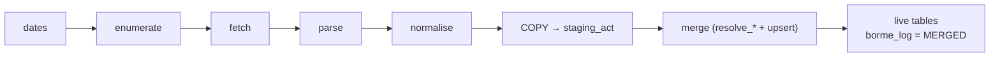

# Feature — Historical backfill

## Summary

A one-time, resumable, idempotent, rate-limited crawl of 2009→present that bulk-loads parsed
acts into staging and merges them into the live model via the shared resolution functions.

## Related specs / ADRs

- Specs: [2 — Ingestion](../specs/02-ingestion.md)
- ADRs: [0006 — Hybrid write path](../architecture/0006-hybrid-write-path.md)

## Functional behaviour

- Iterate dates 2009-01-02 → today via [summary-enumeration](summary-enumeration.md).
- **Configurable date range.** The crawl span is bounded by CLI parameters, defaulting to
  the full 2009-01-02 → today range. A `--month YYYY-MM` shorthand restricts the run to a
  single calendar month (equivalent to setting start/end to that month's bounds) — intended
  for **initial testing** so a small, representative slice can be ingested without a full
  multi-day backfill. Bounded runs remain resumable and idempotent like a full run.
- For each Sección A document: fetch ([document-fetch](document-fetch.md)), parse
  ([act-parsing](act-parsing.md)), normalise
  ([entity-extraction-normalisation](entity-extraction-normalisation.md)), and bulk-`COPY`
  rows into `staging_act`.
- Run a **merge step**: for each unprocessed staging row, call `resolve_company`/
  `resolve_person` ([entity-resolution](entity-resolution.md)) and upsert into the live
  tables with `ON CONFLICT DO NOTHING`; mark the row `processed`; write `borme_log`.
- **Batch** the merge in chunks (e.g. 5–10k rows) to bound transaction size.
- **Resumable** via `borme_log` (skip already-MERGED documents); **idempotent** via the
  `borme_act` UNIQUE constraint. **Rate-limited** (≤1–2 req/s), runnable over several days.
- Runs **locally/off-server** ([ADR-0005](../architecture/0005-java-ingester-and-read-api.md)),
  writing directly to PostgreSQL.

## Data flow

## Inputs / outputs

- **Input:** date-range bounds — explicit start/end dates or a `--month YYYY-MM` shorthand
  (defaults to the full 2009→today range); rate-limit and batch-size config; DB connection.
- **Output:** populated live tables; `borme_log` reflecting per-document status; cached raw
  documents.

## Edge cases

- **Interruption** — restart resumes from `borme_log`; no double-insertion.
- **Per-document parse error** — recorded as `ERROR` with detail; does not abort the crawl;
  retryable independently.
- **Huge transactions** — avoided by chunked merges.
- **Politeness** — must not hammer the BOE; spread over days.

## Acceptance criteria

- A full backfill completes and is re-runnable with no duplicates.
- Killing and restarting mid-run continues correctly.
- Errored documents are isolated and retryable.

## Implementation issues

- [ ] Backfill driver: date iteration + work queue over enumeration/fetch/parse.
- [ ] CLI date-range parameters: explicit start/end dates + `--month YYYY-MM` shorthand for
      single-month test runs (default = full 2009→today range).
- [ ] `COPY`-based bulk loader into `staging_act`.
- [ ] Merge step calling resolution functions + chunked upserts + `borme_log` updates.
- [ ] Resume logic from `borme_log`; per-document error isolation + retry.
- [ ] Rate-limit/backoff config shared with document-fetch.
- [ ] Progress/metrics reporting for long runs.
