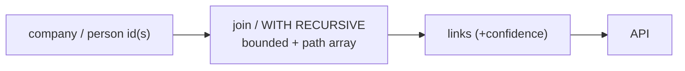

# Feature — Link queries

## Summary

The relationship queries — shared administrator, shared registered address, and bounded
multi-hop connections — implemented as indexed joins and recursive CTEs inside PostgreSQL.

## Related specs / ADRs

- Specs: [5 — Link detection](../specs/05-link-detection.md)
- ADRs: [0010 — Recursive CTEs over graph DB](../architecture/0010-postgresql-ctes-over-graph-db.md)

## Functional behaviour

- **Shared administrator** — self-join `appointment` on `person_id`. Spans the **full
  appointment history** by default (companies that *ever* shared an administrator, current or
  past roles), returning the two companies, the shared (resolved) person and the role(s);
  optionally constrained to overlapping validity for people who held the roles at the same
  time (then also returning the overlapping period). Carries the person's **confidence**.
- **Shared registered address** — self-join `company_address` on `address_id` (stable via
  `resolve_address`'s exact-normalised key). Spans the **full address history** by default
  (companies that were *ever* domiciled at the same address, current or past intervals);
  optionally constrained to overlapping validity for companies co-located at the same time.
- **Multi-hop connection** — `WITH RECURSIVE` traversal of the company⇄person graph, bounded
  by a hop limit, with **cycle detection** via a carried path array; returns the path
  between two companies (or all companies within N hops of one).
- **Temporal classification** — every shared-administrator and shared-address link is
  tagged with whether it is a **current/overlapping** match (the two companies shared the
  administrator or address at the same time) or a **historical** match (the link exists only
  across non-overlapping intervals — they were connected at different times). The result
  reports this `temporal` flag explicitly so consumers never mistake a past coincidence for a
  live connection.
- **Confidence propagation** — two orthogonal dimensions per the model in
  [Spec 5 § Confidence](../specs/05-link-detection.md):
  - **Identity confidence** ∈ [0,1]. Deterministic hops (company by Hoja+province, shared
    address by exact key) contribute `1.0`; person hops contribute the person's resolution
    confidence ([ADR-0009](../architecture/0009-probabilistic-person-resolution.md)). A path's
    identity confidence is the **product of its per-hop confidences**; links below a
    configurable floor (default ≈0.7) are withheld.
  - **Temporal relevance** — a separate `temporal` flag (current/overlapping vs. historical)
    plus an optional **recency weight**. A historical match lowers the *recency weight*, **not**
    the identity confidence — so the deterministic shared-address link keeps `confidence = 1.0`
    even when historical. Identity certainty and recency are reported as distinct fields.

## Data flow

## Inputs / outputs

- **Input:** a company or person id, optional hop limit / date filter.
- **Output:** linked companies/people with link type, period, a **temporal flag**
  (current/overlapping vs. historical) with an optional recency weight, and an **identity
  confidence** ∈ [0,1] (independent of the temporal flag; `1.0` for deterministic links).

## Edge cases

- **Cycles** — prevented by the path array; never infinite-loop.
- **High fan-out** — bounded hop limit guards `work_mem`; document any truncation.
- **No NIF for persons** — person-based links remain candidates.
- **Performance ceiling** — if a query needs >3 unbounded hops or exceeds ~1 s / blows
  `work_mem`, escalate to Apache AGE per [ADR-0010](../architecture/0010-postgresql-ctes-over-graph-db.md).

## Acceptance criteria

- Shared-admin and shared-address queries return correct, deduplicated links with periods.
- Each shared-admin/shared-address link is tagged current/overlapping vs. historical; the
  temporal flag and the identity confidence are reported as **separate** fields (a historical
  deterministic link keeps identity confidence `1.0`).
- Multi-hop traversal terminates with cycle detection and respects the hop limit.
- Person-derived links carry confidence and are never labelled as certain.

## Implementation issues

- [ ] Shared-administrator query (full-history self-join, optional overlap constraint) + confidence.
- [ ] Shared-registered-address query.
- [ ] Bounded multi-hop recursive CTE with path-array cycle detection.
- [ ] Temporal classification (current/overlapping vs. historical) tagged on shared-admin
      and shared-address links.
- [ ] Identity-confidence aggregation across a path (product of per-hop scores), kept separate
      from the temporal flag + recency weight.
- [ ] Query performance benchmarks + the AGE escalation decision gate.
- [ ] API endpoints exposing the above (with [read-api](read-api.md)).
