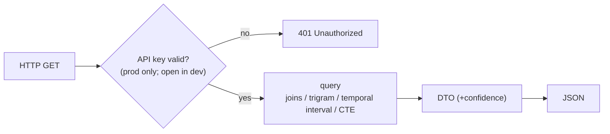

# Feature — Read API

## Summary

The public, read-only Java 25 / Micronaut service over PostgreSQL: company search/detail,
person detail, and the entry points for link queries.

## Related specs / ADRs

- Specs: [6 — Public API](../specs/06-public-api.md)
- ADRs: [0005 — Three Java modules](../architecture/0005-java-ingester-and-read-api.md), [0013 — API key auth, configured per environment](../architecture/0013-api-key-auth-and-config.md)

## Functional behaviour

- **Company search** — `GET /api/v1/companies?q=&province=` → ranked matches using
  `pg_trgm` similarity over `norm_name` (GIN-indexed), optionally filtered by province.
- **Company detail** — `GET /api/v1/companies/{id}` → company + its acts, current and
  historical administrators (from `appointment` intervals), and current/historical addresses.
- **Person detail** — `GET /api/v1/persons/{id}` → the companies the person is/was associated
  with and the roles, each annotated with **confidence** where identity is probabilistic.
- **Link entry points** — endpoints that delegate to [link-queries](link-queries.md)
  (shared admin, shared address, multi-hop); link DTOs carry the **temporal flag**
  (current/overlapping vs. historical) and confidence, reduced for historical matches.
- **Authentication** — a Micronaut security filter requires a valid **API key** (`X-API-Key`)
  on all data endpoints **in production**, returning `401` when missing/invalid. The filter is
  **enabled by default and disabled only in the local/dev environment** (fail-closed); accepted
  keys come from an env var / injected secret ([ADR-0013](../architecture/0013-api-key-auth-and-config.md)).
  Health/readiness probes stay unauthenticated.
- **Stateless**, read-only, every response derived from PostgreSQL; confidence/match
  metadata surfaced wherever identity is probabilistic.

## Data flow

## Inputs / outputs

- **Input:** query params / ids.
- **Output:** JSON DTOs for companies, persons, acts, appointments, addresses and links,
  with confidence where relevant.

## Edge cases

- **Missing/invalid API key (production)** — `401`; no data leaks. **Local dev** needs no key.
- **Auth misconfiguration** — fail-closed: if the environment is not explicitly local/dev,
  auth stays on (never silently anonymous in prod).
- **Ambiguous person id / candidate identity** — responses carry confidence; never present
  a candidate as fact.
- **Large result sets** — pagination + sane defaults.
- **Suppressed individuals** — honour data-protection suppression
  ([data-protection](data-protection.md)); never surface suppressed personal data or residual
  DNI/NIE.
- **Temporal queries** — "administrators on date X" resolved via validity intervals.

## Acceptance criteria

- Search returns ranked, relevant matches; detail endpoints assemble acts + temporal roles +
  addresses correctly.
- Person endpoints expose confidence; suppressed data never leaks.
- Read-only: no endpoint mutates data (writes happen only via the `ingester` backfill and the
  server's scheduled daily job, never over the HTTP surface).
- Production rejects unauthenticated requests with `401`; local dev serves without a key;
  switching is config-only (no code/build change) and fails closed.

## Implementation issues

- [ ] Micronaut app skeleton on Java 25 (config, DB connection, health).
- [ ] API-key security filter (`X-API-Key`), env-toggled, fail-closed; keys from env/secret;
      probes excluded; `401` on missing/invalid.
- [ ] Per-environment config (Micronaut environments `dev`/`prod`); document the env vars.
- [ ] Company search endpoint (trigram ranking + province filter + pagination).
- [ ] Company detail endpoint (acts + temporal admins + addresses).
- [ ] Person detail endpoint (companies/roles + confidence).
- [ ] Suppression-aware serialization (respect data-protection flags).
- [ ] Link-query endpoints (delegate to link-queries feature).
- [ ] OpenAPI spec + API docs (document the `X-API-Key` requirement).
