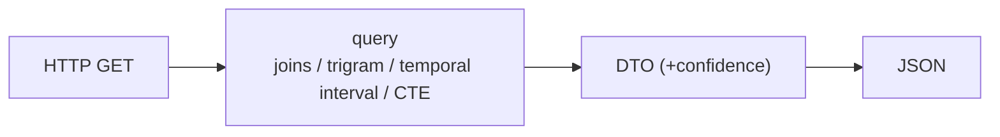

# Feature — Read API

## Summary

The public, read-only Java 25 / Micronaut service over PostgreSQL: company search/detail,
person detail, and the entry points for link queries.

## Related specs / ADRs

- Specs: [6 — Public API](../specs/06-public-api.md)
- ADRs: [0005 — Offline Java ingester + read API](../architecture/0005-java-ingester-and-read-api.md)

## Functional behaviour

- **Company search** — `GET /api/v1/companies?q=&province=` → ranked matches using
  `pg_trgm` similarity over `norm_name` (GIN-indexed), optionally filtered by province.
- **Company detail** — `GET /api/v1/companies/{id}` → company + its acts, current and
  historical administrators (from `appointment` intervals), and current/historical addresses.
- **Person detail** — `GET /api/v1/persons/{id}` → the companies the person is/was associated
  with and the roles, each annotated with **confidence** where identity is probabilistic.
- **Link entry points** — endpoints that delegate to [link-queries](link-queries.md)
  (shared admin, shared address, multi-hop).
- **Stateless**, read-only, every response derived from PostgreSQL; confidence/match
  metadata surfaced wherever identity is probabilistic.

## Data flow

## Inputs / outputs

- **Input:** query params / ids.
- **Output:** JSON DTOs for companies, persons, acts, appointments, addresses and links,
  with confidence where relevant.

## Edge cases

- **Ambiguous person id / candidate identity** — responses carry confidence; never present
  a candidate as fact.
- **Large result sets** — pagination + sane defaults.
- **Suppressed individuals** — honour data-protection suppression
  ([data-protection](data-protection.md)); never surface suppressed personal data or residual
  DNI/NIE.
- **Temporal queries** — "administrators on date X" resolved via validity intervals.

## Acceptance criteria

- Search returns ranked, relevant matches; detail endpoints assemble acts + temporal roles +
  addresses correctly.
- Person endpoints expose confidence; suppressed data never leaks.
- Read-only: no endpoint mutates data (writes happen only via the `ingester` backfill and the
  server's scheduled daily job, never over the HTTP surface).

## Implementation issues

- [ ] Micronaut app skeleton on Java 25 (config, DB connection, health).
- [ ] Company search endpoint (trigram ranking + province filter + pagination).
- [ ] Company detail endpoint (acts + temporal admins + addresses).
- [ ] Person detail endpoint (companies/roles + confidence).
- [ ] Suppression-aware serialization (respect data-protection flags).
- [ ] Link-query endpoints (delegate to link-queries feature).
- [ ] OpenAPI spec + API docs.
