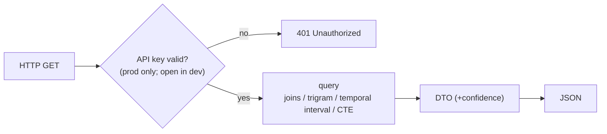

# Feature — Read API

## Summary

The public, read-only Java 25 / Micronaut service over PostgreSQL: company search/detail,
person detail, and the entry points for link queries.

## Related specs / ADRs

- Specs: [6 — Public API](../specs/06-public-api.md)
- ADRs: [0005 — Single Micronaut module](../architecture/0005-java-ingester-and-read-api.md), [0013 — API key auth, configured per environment](../architecture/0013-api-key-auth-and-config.md)

## Functional behaviour

- **Company search** — `GET /api/v1/companies?q=&province=` → ranked matches using
  `pg_trgm` similarity over `norm_name` (GIN-indexed), optionally filtered by province.
- **Company detail** — `GET /api/v1/companies/{id}` → company + its acts, current and
  historical administrators (from `appointment` intervals), and current/historical addresses.
- **Person detail** — `GET /api/v1/persons/{id}` → the companies the person is/was associated
  with and the roles, each annotated with **confidence** where identity is probabilistic.
- **Link entry points** — endpoints that delegate to [link-queries](link-queries.md)
  (shared admin, shared address, multi-hop). Each link DTO carries **two separate fields** per
  the model in [Spec 5 § Confidence](../specs/05-link-detection.md): an `identity_confidence`
  ∈ [0,1] (`1.0` for deterministic links, even when historical) and a `temporal` object
  (`{ flag: "current" | "historical", recency_weight? }`). They are never collapsed into one
  number.
- **Pagination & limits** — collection endpoints (search, a company's acts, multi-hop results)
  are paginated with a default and a hard maximum page size; multi-hop endpoints also cap the
  hop count and bound result size (protecting `work_mem` on the cheap VPS — see
  [link-queries](link-queries.md) and [Spec 8](../specs/08-non-functional.md)). Truncation is
  signalled in the response, never silent.
- **Versioning & errors** — all paths are under `/api/v1`; errors use a consistent JSON problem
  shape (`{ status, error, detail }`) with `400` (bad params, e.g. unknown province), `401`
  (missing/invalid key), `404` (unknown company/person id), `429` (rate-limited), `5xx`.
- **Public rate limiting** — a per-API-key request budget protects the single VPS from
  expensive trigram/CTE queries; exceeding it returns `429` with `Retry-After`.
- **Authentication** — a Micronaut security filter requires a valid **API key** (`X-API-Key`)
  on all data endpoints **in production**, returning `401` when missing/invalid. The filter is
  **enabled by default and disabled only in the local/dev environment** (fail-closed); accepted
  keys come from an env var / injected secret ([ADR-0013](../architecture/0013-api-key-auth-and-config.md)).
  Only the **liveness/readiness probe paths** (`/health/liveness`, `/health/readiness`) are
  unauthenticated, and they expose **only** up/down — no DB internals, counts, or schema state.
- **Stateless**, read-only, every response derived from PostgreSQL; confidence/match
  metadata surfaced wherever identity is probabilistic.

## Data flow

## Inputs / outputs

- **Input:** query params / ids.
- **Output:** JSON DTOs for companies, persons, acts, appointments, addresses and links,
  with confidence where relevant.

## Edge cases

- **Missing/invalid API key (production)** — `401`; no data leaks. **Local dev** needs no key.
- **Auth misconfiguration** — fail-closed: if the environment is not explicitly local/dev,
  auth stays on (never silently anonymous in prod).
- **Ambiguous person id / candidate identity** — responses carry confidence; never present
  a candidate as fact.
- **Large result sets** — pagination with a hard max page size; truncation flagged explicitly.
- **Unknown id / bad params** — `404` for an unknown company/person id, `400` for malformed
  params (e.g. an invalid province code) — distinct from `401`.
- **Query abuse / cost** — per-key rate limit returns `429`; expensive multi-hop requests are
  bounded (hop cap + result cap) so one consumer cannot exhaust `work_mem`.
- **Suppressed individuals** — honour data-protection suppression
  ([data-protection](data-protection.md)): suppressed rows are **filtered out of search,
  detail and link results** (treated as not-present, not a redacted stub), and residual DNI/NIE
  never surface.
- **Temporal queries** — "administrators on date X" resolved via validity intervals.

## Acceptance criteria

- Search returns ranked, relevant matches; detail endpoints assemble acts + temporal roles +
  addresses correctly.
- Person endpoints expose confidence; suppressed data never leaks.
- Read-only for the public surface: no public endpoint mutates data (writes happen only via the
  scheduled daily job and the gated, authenticated admin import endpoint —
  [Spec 6](../specs/06-public-api.md), [historical-backfill](historical-backfill.md)).
- Production rejects unauthenticated requests with `401`; local dev serves without a key;
  switching is config-only (no code/build change) and fails closed.
- The running API conforms to the OpenAPI contract: Schemathesis (cases generated from
  [`api.openapi.yaml`](../specs/api.openapi.yaml)) reports no drift (status / response-schema /
  content-type / header conformance) and no security violations — notably `ignored_auth`
  (every guarded endpoint enforces the `X-API-Key`) and `negative_data_rejection` (malformed
  input is rejected, matching the contract's `additionalProperties: false`).

## Implementation issues

- [ ] Micronaut app skeleton on Java 25 (config, DB connection, health).
- [ ] API-key security filter (`X-API-Key`), env-toggled, fail-closed; keys from env/secret;
      probes excluded; `401` on missing/invalid.
- [ ] Per-environment config (Micronaut environments `dev`/`prod`); document the env vars.
- [ ] Company search endpoint (trigram ranking + pagination).
- [ ] Company detail endpoint (acts + temporal admins + addresses).
- [ ] Person detail endpoint (companies/roles + confidence).
- [ ] Temporal as-of query (`?at=YYYY-MM-DD`) on company/person detail — administrators and
      addresses *as of* a given date, resolved against validity intervals.
- [ ] Suppression-aware serialization (filter suppressed rows from search/detail/links).
- [ ] Link-query endpoints (delegate to link-queries; DTO with separate `identity_confidence`
      + `temporal`).
- [ ] Pagination (default + hard max page size; truncation flag) on all collection endpoints.
- [ ] Consistent JSON error model (`400`/`401`/`404`/`429`/`5xx`) + per-key rate limiting.
- [ ] OpenAPI spec + API docs (document the `X-API-Key` requirement and the error/pagination shapes).
- [ ] Contract conformance + security tests: Schemathesis against the running app
      (drift + `ignored_auth`/`negative_data_rejection`), in a dedicated heavyweight script
      [`script/api-conformance.sh`](../../scripts/api-conformance.sh) (kept out of
      [`script/ci.sh`](../../scripts/ci.sh)); a GitHub job that boots the app + Postgres service
      runs it separately from the main CI pipeline.
