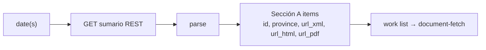

# Feature — Summary enumeration

## Summary

Discover, for any date or date range, which Sección A documents the BORME published, by
querying the BOE `datosabiertos` summary REST API and extracting the list of
`BORME-A-YYYY-NNN-PP` identifiers.

## Related specs / ADRs

- Specs: [1 — Data sources](../specs/01-data-sources.md), [2 — Ingestion](../specs/02-ingestion.md)
- ADRs: [0003 — REST over legacy XML](../architecture/0003-datosabiertos-rest-api-over-legacy-xml.md), [0018 — BOE source politeness & retry](../architecture/0018-boe-source-politeness-and-retry.md)

## Functional behaviour

- Given a date `AAAAMMDD`, request
  `GET https://www.boe.es/datosabiertos/api/borme/sumario/{AAAAMMDD}` with
  `Accept: application/xml`. (The API also serves JSON; only the **XML** representation is
  parsed for now — a JSON variant is deferred, see Edge cases.)
- Enumeration sits behind a **core-owned port** (per
  [ADR-0014](../architecture/0014-hexagonal-architecture.md)) and reuses the existing shared
  `BoeHttpClient` for the GET — it does **not** open a second HTTP path.
- Parse the response into the summary tree (`data → sumario → diario → seccion → item`).
- Select **Sección A** (`seccion[@codigo="A"]`) items and collect each item's
  `identificador` (e.g. `BORME-A-2026-9-01`), `titulo` (province), and the
  `url_xml`/`url_html`/`url_pdf` the summary provides for every item. The `titulo` is carried
  **verbatim** as the descriptor's `province`; mapping it to a `province_code`
  ([ADR-0008](../architecture/0008-registry-coordinates-as-company-natural-key.md)) is a
  downstream normalisation concern, not done here.
- **Identifier handling:** the `identificador` is treated as an **opaque string**, used
  verbatim as `borme_id` and as the cache key. The `BORME-A-YYYY-NNN-PP` notation is
  illustrative only — Mercator never zero-pads, parses, or reconstructs the parts (real ids
  like `BORME-A-2026-9-01` mix unpadded and padded fields), so no padding assumption is baked
  in anywhere.
- Use each item's **`url_xml`** as the document source (no URL construction needed); it can
  also be reconstructed as `xml.php?id={identificador}` if absent.
- Ignore Sección **B** (*otros actos*) and **C** (*anuncios*) for now — they are enumerable
  the same way and reserved for later scope.
- For a range, iterate dates from the **caller-supplied start** to the end date, **skipping
  404s** (non-publication days) as a normal outcome. The lower bound is owned by the caller
  ([historical-backfill](historical-backfill.md), CLI-configurable); `2009-01-02` is the default
  earliest date for which the per-document XML is available. When the end date is "today" it is
  resolved in **`Europe/Madrid`** (the BOE's publication calendar), so the boundary day is never
  off by one. A day that returns 200 but contains **no Sección A items** is also a normal
  "nothing to ingest" outcome, not an error.
- **Enumeration is stateless.** Neither a 404 (non-publication) day nor an empty (no-Sección-A)
  day is persisted — `borme_log` is keyed per **document** (`borme_id NOT NULL`), so a day with
  no documents has nothing to key a row on. Empty/absent days surface only as the in-memory
  "no publication" return signal; re-enumerating a range is always safe and resumability is owned
  per-document by the write paths ([historical-backfill](historical-backfill.md) skips already-`MERGED`
  documents via `borme_log`).

## Data flow

## Inputs / outputs

- **Input:** a single date or an inclusive date range.
- **Output:** a list of document descriptors `{borme_id, province, url_xml, url_html, url_pdf}`
  per publication day — the exact shape [document-fetch](document-fetch.md) consumes as input;
  an explicit "no publication" signal for 404 days. *(`pages` is a per-document field read later
  from the XML `<metadatos>`, not known at summary time, so it is not part of this descriptor.)*

## Edge cases

- **404** → non-publication day; skip, do not error, **not persisted** (no document to key
  `borme_log` on).
- **200 but no Sección A items** → nothing to ingest that day; **not persisted** either, not an
  error.
- **5xx / 429** → retry with backoff via the **single shared rate limiter / retry policy**
  ([ADR-0018](../architecture/0018-boe-source-politeness-and-retry.md)) used by both this and
  [document-fetch](document-fetch.md) — one global ≤1–2 req/s budget, not two.
- **JSON representation (deferred)** — the API also serves JSON (which drops the
  `response`/`item` wrappers and arrays the collections). V1 parses **XML only**; a JSON variant
  is a later, optional addition, not built now.
- **Sección B and C present** — enumerate but skip them (out of scope for V1).
- **Per-document URLs present** — `url_xml`/`url_html`/`url_pdf` are supplied for every item
  (A/B/C) back to 2009; still fail soft per document if a representation is missing.
- **Year rollover** — `NNN` (diario number) resets yearly; never assume monotonicity across
  years.

## Acceptance criteria

- For a known publication day, returns the exact set of Sección A identifiers present in the
  official summary.
- For a known non-publication day, returns "no publication" without raising.
- Enumerates an arbitrary range 2009→today without gaps or duplicates.

## Implementation issues

- [x] Core-owned summary-source **port** returning the day's `DocumentDescriptor` list (per
      [ADR-0014](../architecture/0014-hexagonal-architecture.md)), reusing the existing
      `BoeHttpClient` for the GET — no second HTTP path.
      *(`SummarySource` → `SummaryEnumerationService`, `domain.source`.)*
- [x] Summary REST client: fetch `sumario/{AAAAMMDD}` with `Accept: application/xml`, handle
      404/5xx/429 via the **single shared rate limiter/retry policy** (shared with
      [document-fetch](document-fetch.md), not a second limiter).
      *(`SummaryEnumerationService` builds the URI and calls the shared `BoeHttpClient`; 404 →
      `NotPublished`, give-up → `Failed`.)*
- [x] Summary parser (XML) → typed document descriptors for Sección A items (carrying `titulo`
      as the raw `province`). *(`SummaryXmlParser`; B/C skipped.)*
- [x] Date iterator over an inclusive range with non-publication/empty-day skipping (stateless,
      nothing persisted); resolve an open-ended "today" in `Europe/Madrid`.
      *(`SummarySource.enumerate(start, end)` lazy stream + `enumerateToToday(start)`.)*
- [x] Capture per-item `url_xml`/`url_html`/`url_pdf`; fallback constructor `xml.php?id={id}` if missing.
- [x] Unit tests: recorded summary fixtures (a publication day + a holiday) **and** a
      stubbed-client range-iteration test asserting no gaps/duplicates across an arbitrary span.
      *(`SummaryXmlParserTest`, `SummaryEnumerationServiceTest`; plus a WireMock-backed
      `SummaryEnumerationClientIT` for the HTTP client over a socket.)*
