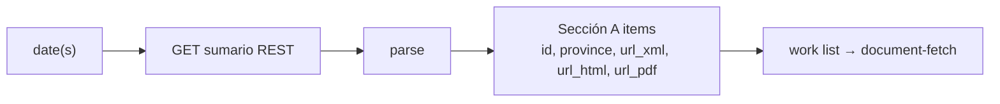

# Feature — Summary enumeration

## Summary

Discover, for any date or date range, which Sección A documents the BORME published, by
querying the BOE `datosabiertos` summary REST API and extracting the list of
`BORME-A-YYYY-NNN-PP` identifiers.

## Related specs / ADRs

- Specs: [1 — Data sources](../specs/01-data-sources.md), [2 — Ingestion](../specs/02-ingestion.md)
- ADRs: [0003 — REST over legacy XML](../architecture/0003-datosabiertos-rest-api-over-legacy-xml.md)

## Functional behaviour

- Given a date `AAAAMMDD`, request
  `GET https://www.boe.es/datosabiertos/api/borme/sumario/{AAAAMMDD}` with an explicit
  `Accept` (XML or JSON).
- Parse the response into the summary tree (`data → sumario → diario → seccion → item`).
- Select **Sección A** (`seccion[@codigo="A"]`) items and collect each item's
  `identificador` (e.g. `BORME-A-2026-9-01`), `titulo` (province), and the
  `url_xml`/`url_html`/`url_pdf` the summary provides for every item.
- Use each item's **`url_xml`** as the document source (no URL construction needed); it can
  also be reconstructed as `xml.php?id={identificador}` if absent.
- Ignore Sección **B** (*otros actos*) and **C** (*anuncios*) for now — they are enumerable
  the same way and reserved for later scope.
- For a range, iterate dates from 2009-01-02 to the target end date, **skipping 404s**
  (non-publication days) as a normal outcome.

## Data flow

## Inputs / outputs

- **Input:** a single date or an inclusive date range.
- **Output:** a list of document descriptors `{borme_id, province, url_pdf, pages}` per
  publication day; an explicit "no publication" signal for 404 days.

## Edge cases

- **404** → non-publication day; skip, do not error.
- **5xx / 429** → retry with backoff (shared with [document-fetch](document-fetch.md)).
- **JSON vs XML shape differences** — JSON drops `response`/`item` wrappers and arrays the
  collections; support whichever `Accept` is configured.
- **Sección B and C present** — enumerate but skip them (out of scope for V1).
- **Per-document URLs present** — `url_xml`/`url_html`/`url_pdf` are supplied for every item
  (A/B/C) back to 2009; still fail soft per document if a representation is missing.
- **Year rollover** — `NNN` (diario number) resets yearly; never assume monotonicity across
  years.

## Acceptance criteria

- For a known publication day, returns the exact set of Sección A identifiers present in the
  official summary.
- For a known non-publication day, returns "no publication" without raising.
- Enumerates an arbitrary range 2009→today without gaps or duplicates.

## Implementation issues

- [ ] Summary REST client: fetch `sumario/{AAAAMMDD}`, handle 404/5xx/429, configurable `Accept`.
- [ ] Summary parser (XML) → typed document descriptors for Sección A items.
- [ ] Date iterator over an inclusive range with non-publication-day skipping.
- [ ] Capture per-item `url_xml`/`url_html`/`url_pdf`; fallback constructor `xml.php?id={id}` if missing.
- [ ] JSON summary parser variant (parity with XML).
- [ ] Unit tests with recorded summary fixtures (a publication day + a holiday).
