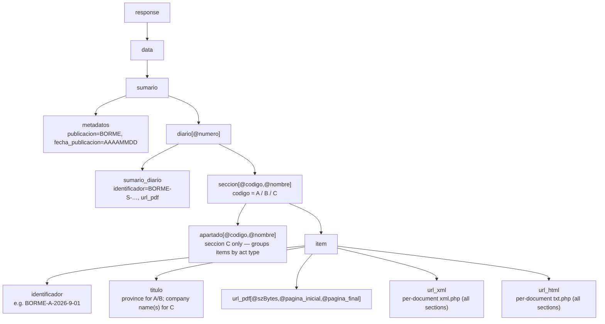

# Spec 1 — Data sources & formats

**Realised by:** [summary-enumeration](../features/summary-enumeration.md),
[document-fetch](../features/document-fetch.md).
**Constrained by:** [ADR-0002](../architecture/0002-txt-php-over-pdf-parsing.md),
[ADR-0003](../architecture/0003-datosabiertos-rest-api-over-legacy-xml.md).

## What this describes

The single external data source Mercator depends on — the BORME, served by the BOE — and
the exact formats, coverage and identifiers Mercator relies on.

## Publication model

- The BORME is published by the **Agencia Estatal BOE** every day **except Saturdays,
  Sundays and Madrid holidays**.
- It is regulated by RD 1784/1996 (Reglamento del Registro Mercantil) and its electronic
  edition by RD 1979/2008.
- The **signed PDF is the only official/authentic format.** Everything else (HTML, XML,
  plain text) is offered as informative-only to aid reuse. Mercator must never claim its
  data is authentic; it cites the source instead.

## Coverage

- Mercator ingests from **1 January 2009** onward — the date the electronic BORME became
  the authentic edition (RD 1979/2008). Earlier editions exist only on paper and are out
  of scope.

## Sections

Verified against live summaries (2009-01-02 and 2026-01-15), the BORME publishes these
section codes:

| Section | Code | Content | Mercator |
|---------|------|---------|----------|
| Sección Primera — *Empresarios. Actos inscritos* | **BORME-A** | Registered acts, grouped one block per province, ordered by postal code. Contains Constitución, Nombramientos, Ceses/Dimisiones, Reelecciones, Revocaciones, Cambio de domicilio/objeto/denominación social, Declaración de unipersonalidad, Disolución/Extinción, ampliaciones/reducciones de capital, fusiones, etc. | **Target section.** |
| Sección Primera — *Empresarios. Otros actos publicados en el Registro Mercantil* | **BORME-B** | Other registry filings announced per province: depósitos de cuentas, depósitos de proyectos de fusión/escisión, etc. Each item names a company + date but carries little structured act detail. | Out of scope for V1 (possible future source). |
| Sección Segunda — *Anuncios y avisos legales* | **BORME-C** | Convocatorias de juntas, fusiones/escisiones, disoluciones, reducciones de capital with creditor opposition, etc. Organised into *apartados* by act type. | Out of scope for V1. |
| Sumario | **BORME-S** | The daily summary listing every document. | Used to enumerate documents. |

> "Otros actos publicados en el Registro Mercantil" is **not** a sub-apartado of Sección A —
> it is a distinct section with its own `BORME-B-…` document ids.
> Concursal acts (sometimes called a "third section") are ignored initially.

## Formats available per section

Confirmed against live data back to 2009-01-02 — every Sección A/B/C item in the summary
exposes **three** representations:

- **PDF** (`url_pdf`) — always available, every section. The only authentic format.
- **Structured XML** (`url_xml` → `xml.php?id=…`) — available **for every section, including
  A and B**, back to 2009. Returns a clean `<documento>` with `<metadatos>` and a `<texto>`
  body segmented into `
` (company header line) and `
`
  (act text). This is Mercator's **primary ingestion format** (see
  [ADR-0002](../architecture/0002-txt-php-over-pdf-parsing.md)).
- **HTML / plain text** (`url_html` → `txt.php?id=…`) — a full HTML page (site chrome +
  metadata header + the same text body). Usable as a fallback, but requires stripping HTML
  chrome that the XML avoids.

> **Correction (verified 2026):** earlier drafts stated structured XML existed *only* for
> Sección C and that Sección A exposed only `url_pdf`. Both are false: the summary provides
> `url_pdf`, `url_xml` and `url_html` for A, B and C, and per-document XML covers Sección A
> back to 2009. The act *fields* (Constitución, Domicilio, Nombramientos, Datos
> registrales…) are still free Spanish prose inside `
` and must be
> regex-parsed — the XML removes HTML scraping and gives clean segmentation, not parsed
> fields.

## Endpoints

| Purpose | URL |
|---------|-----|
| Daily summary (REST, documented) | `GET https://www.boe.es/datosabiertos/api/borme/sumario/{AAAAMMDD}` with `Accept: application/xml` or `application/json` |
| Per-document XML (primary) | `https://www.boe.es/diario_borme/xml.php?id=BORME-A-YYYY-NNN-PP` (also each item's `url_xml`) |
| Per-document HTML/text (fallback) | `https://www.boe.es/diario_borme/txt.php?id=BORME-A-YYYY-NNN-PP` (also each item's `url_html`) |
| Per-document PDF (fallback / authenticity) | `https://www.boe.es/borme/dias/YYYY/MM/DD/pdfs/BORME-A-YYYY-NNN-PP.pdf` (also each item's `url_pdf`) |
| Legacy XML *summary* (avoided) | `https://www.boe.es/diario_borme/xml.php?id=BORME-S-YYYYMMDD` |

Behaviour to rely on:

- The summary endpoint is **GET-only over HTTPS**; POST/PUT returns 403.
- The `{AAAAMMDD}` date is mandatory; **non-publication days return 404** and must be
  skipped, not treated as errors.
- In the summary, **every item (Sección A, B and C) exposes `url_pdf`, `url_xml` and
  `url_html`.** Mercator uses each item's `url_xml` directly (no URL construction needed);
  the `xml.php?id=…` it points to also works if reconstructed from the identifier.

## Summary structure (REST)

The JSON variant drops the `response`/`item` wrappers, turns `diario`/`seccion`/items
into arrays, and puts the PDF URL string under `url_pdf.texto` (`url_xml`/`url_html` are
plain strings).

## Identifier scheme

- Document IDs follow `BORME-{A|B|C|S}-{year}-{number}[-{province}]`.
  - `number` (NNN) is the *diario* number, resets yearly.
  - `province` (PP) is the province sub-document number (up to 52 slots; not all publish
    every day).
- The **CVE** uniquely identifies each act/page for authenticity verification.
- **Datos registrales** inside the act text encode registry coordinates: `T` (Tomo),
  `L`/`F` (Libro/Folio), `S 8` (registry section for sociedades), `H` + province letter +
  number (Hoja registral), `I/A` (Inscripción/Asiento), and a date.

## Caveats

- The per-document `xml.php` and `txt.php` representations are informative-only (only the
  signed PDF is authentic) and not formally guaranteed as APIs; the BOE could change them.
  Raw responses are cached and PDF is retained as a last-resort fallback.
- `url_xml`/`url_html` were verified present for A/B/C back to 2009, but Mercator should fail
  soft per document (XML → `txt.php` → PDF) rather than assume availability.
- If the legacy `xml.php` *summary* endpoint is ever used, its tag casing must be confirmed
  against a live file; the documented REST summary API is the safer target.
