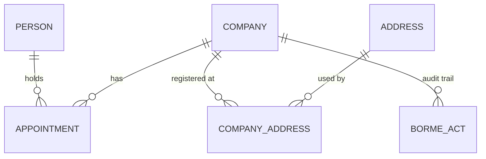

# Spec 4 — Data model

**Realised by:** [database-schema](../features/database-schema.md),
[entity-resolution](../features/entity-resolution.md).
**Constrained by:** [ADR-0004](../architecture/0004-postgresql-as-primary-datastore.md),
[ADR-0007](../architecture/0007-single-source-of-truth-entity-resolution.md),
[ADR-0008](../architecture/0008-registry-coordinates-as-company-natural-key.md),
[ADR-0009](../architecture/0009-probabilistic-person-resolution.md).

## What this describes

The entities Mercator stores, how they relate, and the identity rules that govern them —
at a conceptual level. The concrete tables live in
[database-schema](../features/database-schema.md).

## Entities

- **Company** — a registered company. Carries raw and normalised name, legal form,
  province, and registry coordinates (Hoja, Tomo…), plus first/last-seen dates.
- **Person** — an individual playing a role (administrator, attorney, liquidator…).
  Carries raw and normalised name only.
- **Address** — a registered domicile. Carries raw and normalised text, and where
  parseable, municipality and province.
- **BormeAct** — one act extracted from one document for one company: its type, the source
  document id, CVE, publication date, registry coordinates and raw text.
- **Appointment** — a temporal role link between a person and a company: the role, the
  event (nombramiento/cese/reelección/revocación), the originating act, and a validity
  interval (`valid_from`, `valid_to`).
- **CompanyAddress** — a company's registered address over time, with a validity interval.

## Relationships

- A company has many acts, many appointments (over time) and many addresses (over time).
- An appointment ties exactly one person to one company for a role and time interval.
- Acts are the audit trail; appointments and company-address rows are the derived,
  query-friendly temporal state.

## Identity rules

- **Companies** are identified by their **registry coordinate**: Hoja + province. The
  BORME publishes **no NIF/CIF**, and the Hoja is unique within its provincial registry,
  so it is the closest thing to a stable natural key
  ([ADR-0008](../architecture/0008-registry-coordinates-as-company-natural-key.md)).
- **Persons** have **no identifier at all**. Person identity is therefore *probabilistic*:
  resolved by normalised name plus corroboration (co-occurrence in the same company or
  registry). Person links are stored as **scored candidates**, never as hard facts
  ([ADR-0009](../architecture/0009-probabilistic-person-resolution.md)).
- **Addresses** are identified by their **exact normalised text within a province**
  (`norm_text` + province). Identical addresses collapse to one row so companies sharing a
  domicile share one `address_id`; this is what makes the shared-address link a deterministic
  join (see [Spec 5](05-link-detection.md)). Spelling variants are bridged by trigram
  *search*, never by merging address identity.
- **Resolution lives in exactly one place.** The parser emits normalised-but-unresolved
  records; deciding "is this an existing company/person" happens only in the shared
  resolution functions, called by both write paths
  ([ADR-0007](../architecture/0007-single-source-of-truth-entity-resolution.md)).

## Temporal semantics

- An appointment's `valid_from` is the publication date of its nombramiento; `valid_to` is
  the publication date of the matching cese, or `NULL` while current.
- The same applies to company-address intervals: a new domicilio closes the previous one.
- This lets the API answer "who were the administrators on date X" and "which companies did
  person P run, and when".

## Extensibility

Adding a new act type (capital changes, fusiones, disoluciones…) adds enum values and, at
most, act-specific payload fields — **not** new core entities. The Company/Person/Address/
Act/Appointment shape is stable across the full vision.
